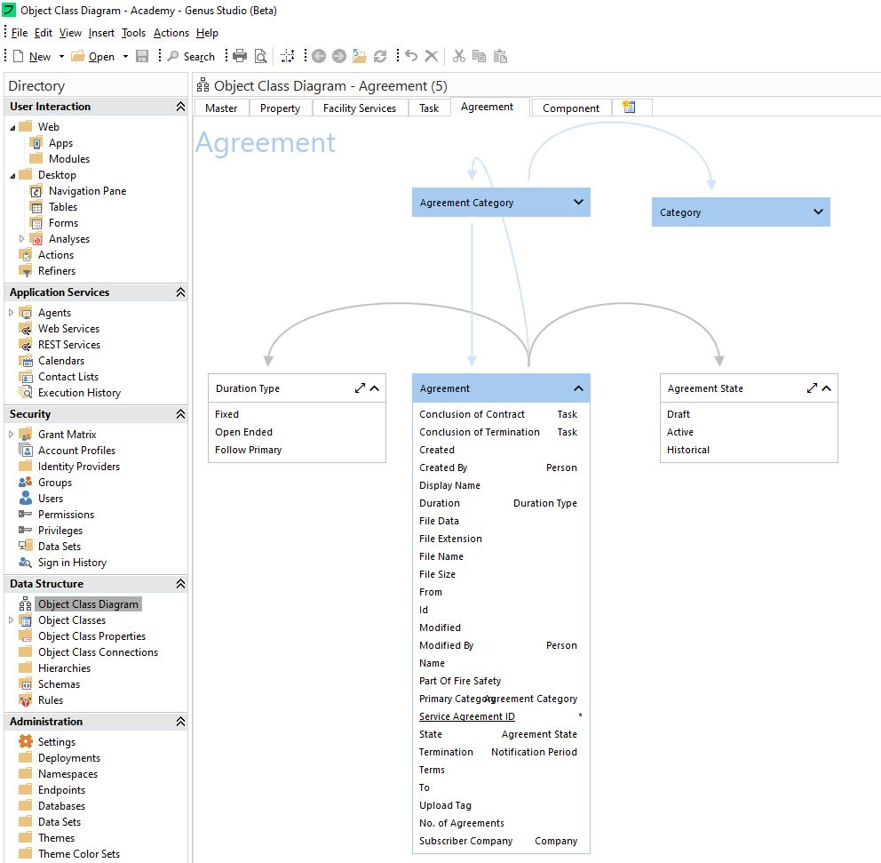
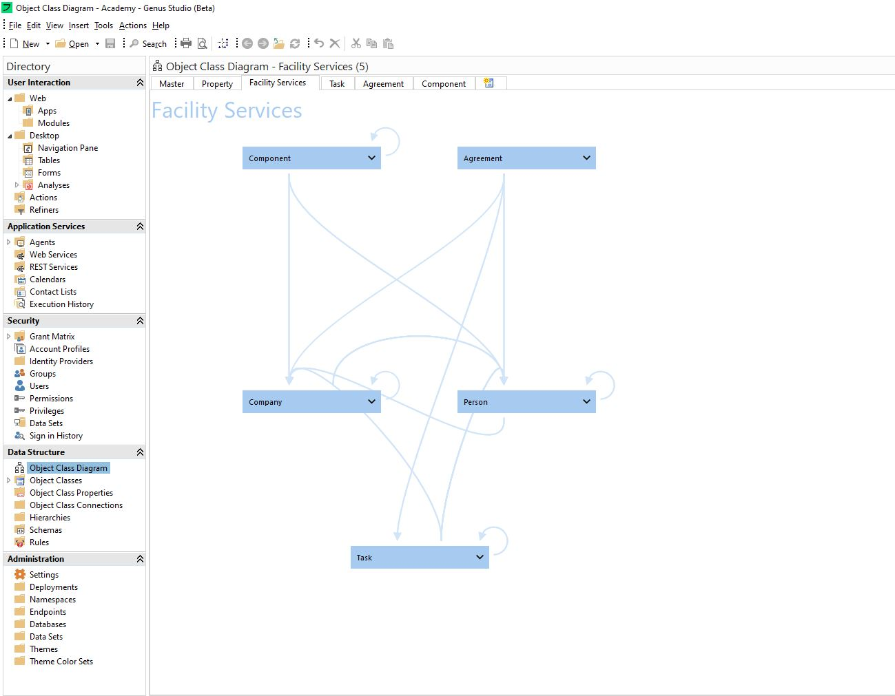

# Data Model in Genus
**SESSION BY INSTRUCTOR:** *The instructor will start off by giving you a brief introduction to the topic. The session will include a review of the components that build a Genus application.*

Now that you're familiar with the Genus Clients, we're going to have a look at the Data Model.

When we talk about models in Genus, we are talking about the description – or model - of the real world, or real business case, that we build in Genus through your application. While the term “model” is often used to describe a simplification of reality, the Genus model is a literal translation or description of your application.  In other words; “The model is the Application”.
This application model, or description, can be split into three main parts:

<table>
  <tr>
    <td>Data Model</td>
    <td>The Data model, or data structure, is the description of your business entities – their properties and their relationships to other business entities. These business entities are known as “Object Classes” in Genus. </td>

  </tr>
  <tr>
    <td>Business and Application logic</td>
    <td>Business and application logic is developed using the building block named “action”. An action sequentially executes a number of effects, and can communicate with integrations, alter data in your data model, create reports, handle exceptions and much more. Here, you can store complex business logic, automate whole processes and support user actions.</td>

  </tr>
  <tr>
    <td>User Interfaces</td>
    <td>In the previous section, we had a look at our application clients – Genus Web and Genus Desktop. Genus Studio includes a visual drag-and-drop development environment for designing user interfaces for both targets. The user interfaces are connected to both the data model and business logic actions. </td>

  </tr>
</table>

 

These three parts – the data model, the business and application logic, and user interfaces - sum up to the Genus Application Model – the model you create in Genus Studio to meet your business needs.

Because the Business Logic is applied to, or utilizes, some knowledge or stored data relating to the data model and user interfaces also are dependent on data to display, we will start looking at our Data Model.

## Object Classes
Object Classes are logical representations or abstractions of the business entities your model describes. Some Object Classes can translate quite literally to a real world concept (such as "employee"), others can be more abstract and is given meaning by its content (such as Category).

Most object classes are persisted, or saved, permanently in a data storage, while some can be locally used with a life span restricted to a user's session. If you're familiar with databases or database theory, an object class share many similarities with a database table. It defines a concept and the columns (or properties) represents the features, these may refer to other tables (or object classes) through foreign keys; ID references to related objects.

A persisted Object Class always corresponds to a database table, which is where any updates to the data is stored.

### Object Class Settings
There are a lot of settings you can define on the Object Class level - ranging from display related (naming, searching and sorting) to requirements for data uniqueness and access privileges.
The most commonly used may be:

<table>
  <tr>
    <td>Data Integrity</td>
    <td>  Uniqueness and Delete Constraints: These constraints allow for restricting data row content before they are saved or deleted - typical use cases are "Don't allow for saving a user if another user with the same username/email combo already exists" or "Don't allow for deleting active users". Users are warned when these constraints are met.  </td>
  </tr>
  <tr>
    <td>Search</td>
    <td>Here, you can define which Object Class Properties can be used to look up data for the Object Class.</td>
  </tr>
  <tr>
    <td>Explore</td>
    <td> In this section, you can make the end user's navigating through the desktop solution easier.    
    *Views*: Defines the columns (or properties) that will represent the Object class when listing instances of the object class in instances where the user may ask to view what data is the basis for a number or restriction (such as; "3 Related Objects prevents you from deleting this object").  
    *Default Form*: Defines which user interface will be opened on the Desktop solution when a user asks to view an instance of the Object Class. </td>

  </tr>
  <tr>
    <td>Display</td>
    <td>The Object Class Properties selected here, will be the default display representation for a row of this Object Class.  </td>

  </tr>
  <tr>
    <td>Auditing</td>
    <td>Auditing can be enabled if data events should be logged, such as creations and modifications of Object Class instances. </td>

  </tr>
  <tr>
    <td>Security</td>
    <td>In the Security section, you can restrict access to the Object Class in several manners; you can restrict whether instances of the Object Classes can be modified after creation, or even if new instances can be created at all. You can also define how user's access to the Object Class is defined, restricting based on security groups </td>

  </tr>
</table>

## Object Class Properties
Each Object Class is built from its properties. Many properties correspond with a database column, the way many object classes corresponds to a database table. You can however create properties that are composite of several other properties, based on a SQL subquery or not bound to any database column.

Even though most Object Class Properties correspond to a column in a database table, Genus provides a lot of functionality on top of this, from data interpretation and display rules, to security permissions and trigger based rules.

### Object Class Property Settings
A variety of features and restrictions can be applied to each Object Class - the most common ones;
 

<table>
  <tr>
    <td>General</td>
    <td>This is where you see the general information about the property - what datatype it consists of and whether the field should be interpreted as another object class, an email string etc. **Data interpretation is crucial in the data model, and determines how your property fields are treated and displayed throughout the entire Genus model - it cannot be altered after you initially define it so always make sure to double check it!** </td>
  </tr>
  <tr>
    <td>Data Calculation</td>
    <td>Some fields are mechanically/automatically calculated by Genus, either to provide a suggestion value to the user or to fill out values the user should not be able to input themselves.  
    *Default* values are calculated when the object is initially created. *Formula* values are recalculated when the object is altered.</td>
  </tr>
  <tr>
    <td>Data Validation</td>
    <td>Data validation can be added to ensure value requirements are met - such as formats or not allowing an object to be saved without critical properties being populated.  </td>
  </tr>
  <tr>
    <td>Security</td>
    <td>Like with the Object Class, Object Class Properties access and alteration access can be restricted. For instance, you can restrict whether the property can be modified after creation or not. You can also allow access granting on a Security Group level, if the property contains sensitive information that should not be accessible for all users who have access to the data object as a whole. </td>

  </tr>
</table>

 
 

## Object Class Diagrams

In the "Data Structure"-section of Genus, you also find the "Object Class Diagram" tool. This is a visualization tool, used to document or develop the data model. Here, you can create visually intuitive diagrams that display Object Classes, their properties and how these properties refer to other Object Classes. Object Class Diagrams are especially useful when familiarizing yourself with a new domain or Genus environment, as well as when modelling new Object Classes to get a visualization of how the new objects will fit into the existing data model.

While there are no strict categories of data diagrams, but we want to highlight a few different use cases:

### Data Driven Diagrams

These diagram provides an overview of the subsection of the data model concerning itself with a somewhat contained topic (such as agreements in the below example) in the solution, including it's most important references to other objects(such as Company and Category). These data driven data diagrams are very useful when new business engineers are introduced to the data model, or when expanding an existing data model. When you introduce a new part of the domain into the data model, consider if adding a data diagram may be a useful way to document your work in an easily digestible format. If you use the data diagram as a supporting tool to model you new data objects, a lot of this work is already done by the time your data model is in place. Remember that the data diagram does not have to be complete - leaving some less important connections out to increase readability may be preferable.

**Agreement:** **

### Functionality/Domain Driven Diagrams

This diagram does not display a separate subsection of the data model, or data domain, but rather which parts of the data model is considered a part of the functionality domain "Facility Services". Data diagrams like this can provide a useful overview of interconnectedness at a higher level that data driven data diagrams, and can present the solution from specific users' perspective.

**Facility Services:** *The Object Classes included in the Facility Services domain, and their connections, are presented here. Note that Object Class Properties are hidden, as this level of detail is not the main concern here. A modeling user can always expand these details as needed. Also note that several Object Classes refer back to itself - this is not uncommon and simply represents that a property for the object class contains a reference to a different instance of the same object class.*

<table>
   <tr><td><a href="e1.2-genus-studio.md"><- Previous</a></td><td align="right"><a href="e2.1-object-class.md">Next -></a></td></tr>
</table>
