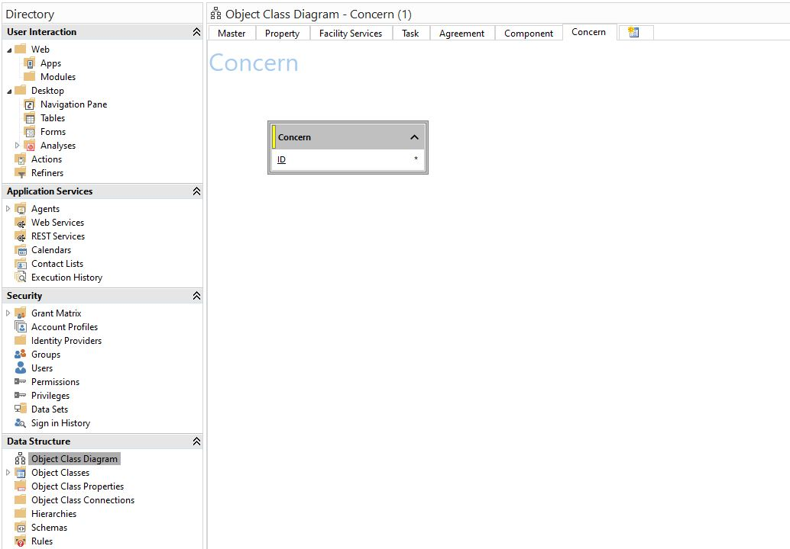

# 2.1 Introduction to Data Modeling and designing a new Object Class
The first part of these exercises will concern the creation of new object classes. A Genus application delivered to a customer will typically support all or parts of its business model. For instance, an application model may cover a large part of an employment agency's business model by supporting case management, shift delegation, resource handling, time reporting, document archiving, communication (e-mail/SMS) and integrations with external systems. Some clients may focus heavily on the reporting, while others have their main focus on case management or incident handling.

One thing is common for all application models, whether it's a full-scaled case management solutions, Business Intelligence solutions or technical integration solutions - they all have an object model. An object model is a representation of business objects within the domain, describing each objects' features and its connections between to other objects. The object model often corresponds to the model in the database, but is also modelled/reflected in Genus, where we have additional logical connections, information and even object classes that doesn't exist in the database. The advantage of creating the object model in Genus, is that Genus maintains connections, dependencies, primary keys, data consistency, data types, creation, modification and deletion of data. Deletion rules, duplication rules, validation rules, automatic rules (equivalent to "triggers" in the computer language) - these can all be controlled in Genus.

The object model is exposed to the end user through tables or "forms", combined with actions, searches and other functionality in the web or Desktop client. The developer sets up the object model, the logic of actions, the search properties and the GUI using Genus Studio, which you now will get to know even better.

In Genus Studio, we refer to an object (e.g. Company) as an «Object Class». The properties of the object (e.g. "Name" or "Org No") are called «Object Class Property» or just «Property».

## Extending our Data Model
The proposed Genus Facility Management solution has a simple object model outlined in the Case-description. We want to add a new area, or functionality, to this model. Tenants want to be able to report issues they experience with their properties, so the Property Manager is alerted of potential issues and can create tasks where needed. This new Object Class will be named "Concern". The name is chosen because while the tenant is reporting a perceived issue, there is no guarantee that action is required from the Property Manager. Concerns can be handled by the Property Manager, and dispatched to tasks where appropriate. To achieve this, the first thing we need to do is add the Object Class "Concern" in our data model.

To construct an Object Class in Genus Studio, an equivalent table that the object class can refer to must exist in the database. There are two ways of creating new Object Classes:

###Option 1
You can always create and run the table creation SQL directly in the database development tool. If you have experience with SQL, you can write a SQL statement from scratch to create the database tables and columns directly in SQL Server Management Studio. Using this method, it's important to ensure that the datatypes of columns that are intended to reference other Object Classes match the ID column of the Object Class (or table) they are meant to reference. By referencing these tables, you can build the objects (Object Class/Object Class Properties) correctly in Genus Studio. The database table you create here, can then be imported into Genus and property definitions set. *Initially, we recommend that you try Alternative 2 instead of this one. If you choose this option, use the field descriptions from #2.1 below as the base for your SQL-query, add the table and go to #2.4.*
###Option 2
You can also create a draft of your new Object Class, and make Genus Studio generate the SQL statements for you. With this option, you will use the Object Class Diagram tool to generate a «Draft» Object Classes and «Draft» Object Class Properties that don't exist in the database yet. This feature can be very useful when you are in an object model design-phase, and want the model to be QAed before the tables are actually created in the database. It is easier to modify and tweak a Draft-object in Genus Studio, than it is to modify tables after initial creation directly in the database. If you want to add or remove an attribute/field, the latter requires changes in 2 places; both in the database and in Genus Studio. The Object Class diagram also sets the datatype to automatically match with identifying columns of Outbound Reference Objects. Thus; this alternative is a good option if you have limited experience with SQL, or if you want to sketch and visualize the new Object Class before creation.

In the first exercise, you will use option 2 to get familiar with this method. However, in later exercises, you will create tables with option 1.

## 2.1 Create a new Object Class

Your first task, is to model and create (or import) the new Object Class "Concern" with all Object Class Properties required to describe a concern reported by a tenant. This includes; location, description, what users have created or modified the concern and current state. We also want to enable a Property Management responsible to connect a concern to a task, if any tasks are created as a result of the reported concern. Thus, we need a property for "Task" as well.

### 2.1.1 Create a Draft Object Class "Concern"

Navigate to "Object Class Diagram" under Data Structure. Create a new diagram "Concern" for sketching up the Concern module. Insert a new "Class (Draft)" by right-clicking anywhere in the empty diagram sheet and hovering over "Insert". In the dialog box that pops up, you'll set the Logical Name equal to the object in Genus ("Concern") and the Physical Name equal to the name of the table that is to be made in the database ("Concern"). The Object Classes will often have different logical and physical names because most database naming conventions prefer no spaces in table names (underscores or camel case are often used instead).

*Notice that the new object is greyed out, unlike the Object Classes that you can see in the other Diagrams. This indicates its status as a draft. A property named «ID» has also been auto-generated for the object, and is the identifying column (or primary key) for the Object Class in Genus, and the table in the database. Note that the ID column is set as a GUID/uniqueidentifier as default. In cases where one want a different primary key (such as a string or integer), this property can be modified by double clicking and setting a new Data Type.*

### 2.1.2 Add Properties to Concern
While our primary key column was automatically generated, we still need to add the other properties.  As mentioned above, we need properties describing location, description, state, involved users and related tasks.

When adding properties that are "Outbound References", note that entering the Object Class the property is referring to will automatically set the correct Data Type.

Now, we're to add the rest of the needed properties, paying extra close attention to Outbound References. A closer description of the procedure is found below the list.

<!-- * FirstName (varchar(100))
* LastName (varchar(100))
* Company (Outbound reference to object “Company”)
* Mail (varchar(100))
* Mobile (varchar(100))
* Position (varchar(100))
* State (Outbound reference to object / code domain “Object State”. This is an internal code domain consisting of «Active» and «Inactive»)
* Created Date (datetime)
* Created By (Outbound reference to object «User»)
* Modified Date (datetime)
* Modified By (Outbound reference to object «User») -->

*  Subject (varchar(240))
*  Note (varchar(520))
*  ReportedDate (datetime)
*  ModifiedDate (datetime)
*  **ModifiedByPersonID (uniqueidentifier) (Outbound reference to object "Person")**
*  CreatedDate (datetime)
*  **CreatedByPersonID (uniqueidentifier) (Outbound reference to object "Person")**
*  ConcernNo (int)
*  **ConcernStateID (int) (Outbound reference to object / code domain “Object State”.** This is an internal code domain consisting of «Active» and «Inactive»)
<!-- -- CheckedDate datetime,
 -- CheckedByPersonID uniqueidentifier,-->
*  **CompanyID (uniqueidentifier)  (Outbound reference to object “Company”)**
*  **PropertyID (uniqueidentifier) (Outbound reference to object “Property”)**
*  **CategoryID (uniqueidentifier)  (Outbound reference to object "Category")**
*  **CompletionCodeID (int)  (Outbound reference to Code Domain "Completion")**

<!-- *  **BlockID (uniqueidentifier) (Outbound reference to object "Block")**
*  **FloorID (uniqueidentifier)  (Outbound reference to object "Floor")**
*  **AreaID (uniqueidentifier)  (Outbound reference to object "Areas")**
*  **AddressID (uniqueidentifier)  (Outbound reference to object "Address")**
*  **StreetID (uniqueidentifier)  (Outbound reference to object "Street")** -->

 <!-- ComplianceAreaID int,
--  CorporateCompanyID uniqueidentifier-->

*Guidance: Add Object Class Properties to the draft object by right-clicking it (Concern -> Insert -> Property (Draft) or hotkeys CTRL+Shift+'+').*
References to other classes that are present in the data diagram already can easily be made by pressing the Alt-key while selecting an object and dragging it into the drafted Object Class. For Object Classes that are not present in the Data Diagram, you can choose between the entire data model in the dropdown menu available when modifying a property draft. Both methods will automatically provide an outbound reference with correct data type set for you.

When you add a new draft Property, you define its Logical Name (the name of the field in Genus Model), Physical Name (the name of the field in the database), Outbound reference (the object that the field is representing or "pointing at", e.g. a «Company») and Data type (e.g. «varchar(120)» for text where 120 is the number of characters, «int» for integer, uniqueidentifier for primary keys or ID-reference, and so on. As mentioned before, the data type is very important and thus is set automatically if you choose an Outbound Reference).

Best Practice when it comes to naming a database column (Physical Name) is to use the "camel cased" version of the Logical Name. E.g. a field with Logical Name «First Name» should be «FirstName» in the database (Physical Name). The exception is references to other objects. The property "Company" should have Physical Name "CompanyID" to indicate that the field is refering to another object's ID. Apart from this, always strive to follow naming conventions that match those already in use for the project, or database.

#2.1.3. Generate SQL-script (forward engineer)

Now that we've defined the Object Class and its properties, we need to feed the equivalent information into our database, so we have a database table to fetch data from and populate data to.

Open the «Actions» menu (at the top), and choose «Forward Engineering». Select object «Contact» from the list of objects in the data model. Check the "Create Table" in the "SQL Script Contents" and click Next. This will generate a SQL script that can be used to create the Concern-table in the database with the definition we've just set for the Object Class. Copy the script and run it in SQL Server Management Studio in your assigned database.

You have now made the table "Concern" in the database, and will soon model the associated Object Class in Genus.

Once again, we emphasize that you don't have to build Draft object classes, but that it can be a useful tool whenever you want to verify the object model against others (both internally and along with customers) before creating tables in the database and modeling actual object classes. It is easier to change a drafted object model than an actual object model. A fairly large portion of time on the object model when we design business applications, since it is a well known fact that changes made on an application's "data layer" is more costly once GUI and logic has been added.

 
 
