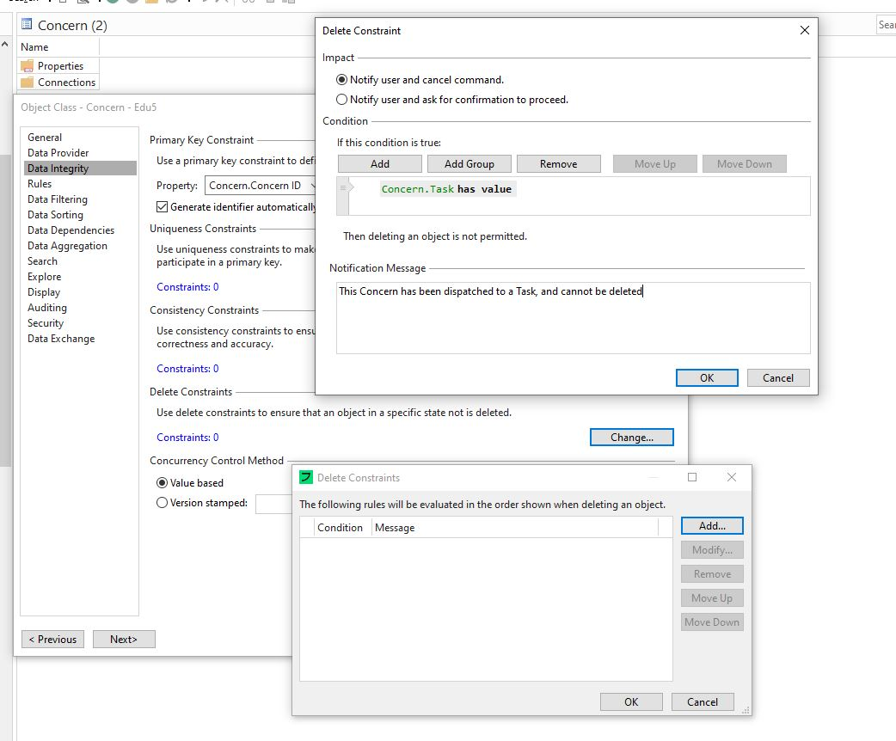
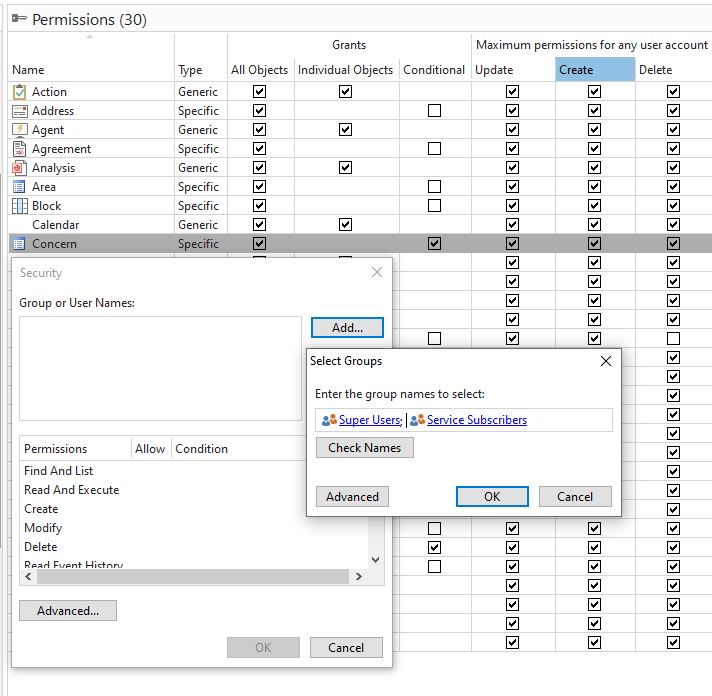
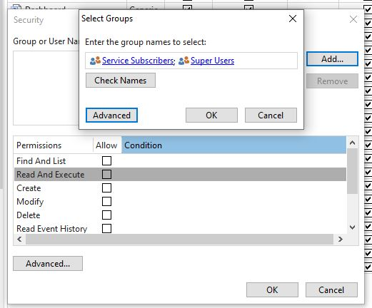
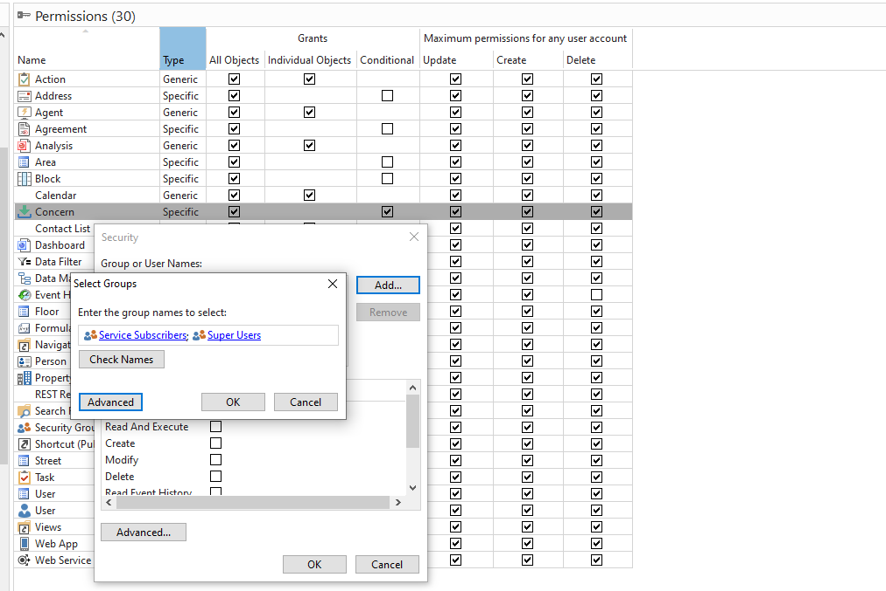
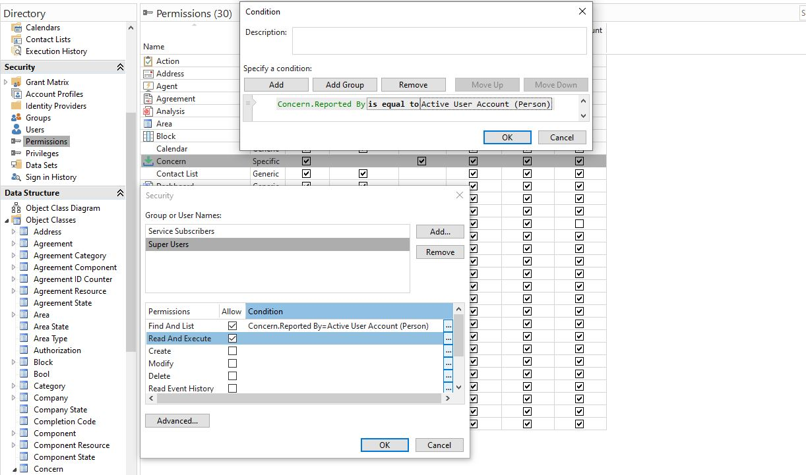
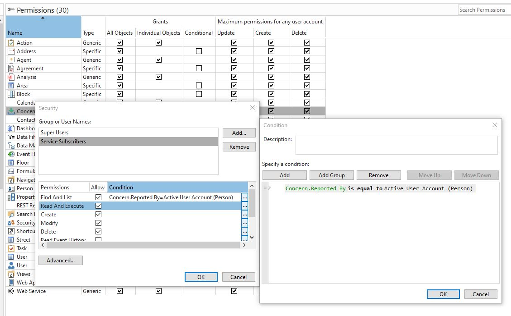
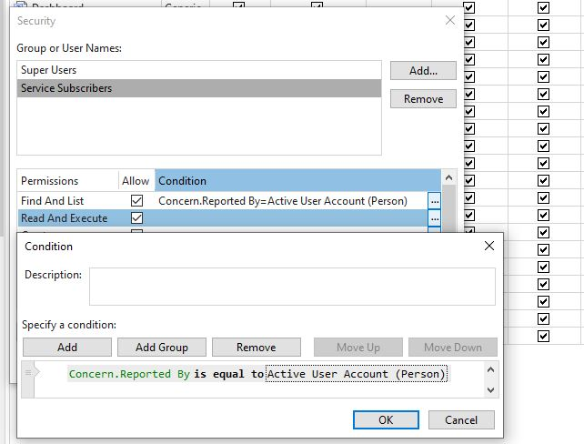
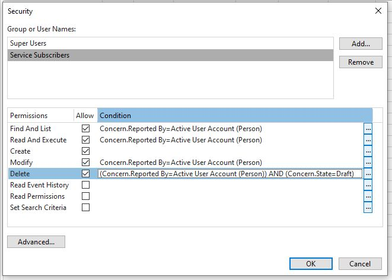

# 2.2 Defining Object Class in Genus from Database table


## 1. Build object class "Concern" in Studio.

Now that our database table is defined, we still need to "update" the Concern from Draft to Object Class, by importing the Object Class from the database and into Genus. To do this, we will follow an import Wizard and customize settings to our Object Class "Concern" and eventually all its properties.

*Guidance: Navigate to Object Classes in Studio (left pane) and right-click -> New -> Object Domain. Go through the wizard, following the directions below.*

1. **Data Provider** Select the database from which the table will be read (it will be set by default if there is only one database, but an application in Genus might have tables in several databases).
2. **Action** Stick with the default "Create a new Object Class"-action. Select the table you will be modeling. This list of tables available to model in Genus is collected from the database, and you will find your new database table "Concern" here. You have the opportunity to override the object's name shown in Genus (e.g. if the table has a more technical name).
3. **Table columns**: Choose which columns you want to model. By default, all of them are selected. As we've designed the database table ourselves, we do want to import all columns in this case. Sometimes not all columns are needed, or you are modelling objects in Genus based on existing database tables that are designed with a different or wider use case than you need.
4. **Primary key**: Select property "Concern ID" and check the «generate identifier automatically». The latter allows Genus to handle uniqueness and the creation of primary keys.
5. **Property definitions**: Double-click on each row/property to verify, and change if needed, the data type and data interpretation, as well as the name. **It is important that Data interpretation is changed wherever needed, as this affects the model interpretation and cannot be altered without re-adding the property again later.** For instance, the field **«Created By»** is supposed to be a reference to the object «Person». This interpretation will affect how the property is treated throughout the entire solution, and will provide the opportunity to connect the property a user session. Genus will not be able to figure this out unless you specify the interpretation yourself. Double-click on the row and change the data interpretation to "Person" (when you do this, the Display name is also changed to "Person"". **Rename it "Reported By" instead**). Repeat the process for all properties that are bolded in the following properties list: (**Modified By** (interpretation "Person"), **State** (interpretation “Concern State”), **Company** (interpretation «Company», name "Subscriber Company"), **Property** (interpretation "Property"),  **Category** (interpretation "Category"), **CompletionCode** (interpretation "Completion"). **DispatchedTask** (itnterpretation and name "Task"). Also rename "Created Date" to "Reported".
6. Step «Naming»: This is the attribute that sets the standard naming of the object. Here you can press Add.. and add Concern No and Subject. Click on Finish.

If you expand the node «Object Classes» in Studio, you should now see the Concern-object. If you expand Concern further and click on Properties, you will find the list of Object Class Properties belonging to Concern.

The core of your Object Class is now in place, but there are still some work to be done, especially in terms of property customization.
<!--
**Block** (interpretation "Block"), **Floor** (interpretation "Floor"),  **Area** (interpretation "Area"),  **Address** (interpretation Address), -->


<!-- **Modified By** (interpretation "Person"), **State** (interpretation “Object State”), **Company** (interpretation «Company»), **Property** (interpretation "Property"), **Address** (interpretation Address), **Category** (interpretation "Category"), **CompletionCode** (interpretation "Completion") -->


## 2. Object Class Properties

While we just defined the Object Class' id column and properties, more settings are available on the Object Class level. Find Concern in the list of Object Classes (right click the folder-level and click "Explore", or restart Genus Studio if you cannot see it). Right-click the Object Class in the list, and choose "Open". Some settings have already been wholly or partially set, such as Data Provider and Integrity.


1. **Data Integrity:** This is where essential requirements for identification of Concerns, and restrictions for creations and deletions **based on data content** (not security policies) are defined. We note that if a Task has been attached to the Concern, the Property Manager has taken action based on the Concern and it should not be deleted to ensure traceability. Thus, we want to add a delete constraint. A delete constraint is a condition each concern being deleted will be checked on, and if the given concern **meets the condition** a user will be warned that the concern *shouldn't or can't* be deleted. In this case, we want to enable this warning *if Concern.Task has value*. Click "Add..." in the delete constraint section, and add the following:




*This is your first interaction with Genus' Condition editor. This is used whenever you want to condtionalize anything; reading filtered data, making decisions in tasks based on data or to make conditional decisions on data fields. You can compare data sources and data fields to reference values, these comparison values are usually data fields from other sources, formulas (which can use static values in combination with other data source fields) or a selection of values from a code domain. You can also do more complex comparisons, such as "does not exist" or "exists" checks. On the left side double-clicking or right-clicking and selecting "Select Field or Group" will show you which data sources are available at any given time. In this case, only Concern and "Session-based" sources are available. Session-based variables are marked in blue or green and are always at the bottom of the Data Source listing. These are connected to the active user session and can provide information about the logged on user, or any errors that occur while running the application. For the Operator ("has value" here), you can right-click to view all options.*


2. **Data Sorting:** This defines a default sorting when listing out the Object Class in tables etc, but can be overridden in specific tables later. Set "Concern No" - this will be an incremental identity column, which we will set up in the next step.

3. **Search:** This is where you define global search properties concerning your Concern class. Keep "Enable Search" checked, and in click "Modify..." in the Search Properties section. Add relevant search fields (such as Category, State etc). Make sure Subject has "Generic Search" checked off. This means that the initial free-text search that's available will find hits on this field.

4. **Display:** Add Naming fields "Concern No" and "Subject", if you didn't already in the Import Wizard. You can also add a Symbol at the bottom. Search for 1379 and add it, symbolizing an inbox of reported concerns.


5. **Security:** We want to limit which users can create and view concerns based on their role (or security group). Check both "Allow granting of permission to all objects" and "allow using conditions". This will let us create access limitations at a very fine level.

To follow up on this, we're going to head to "Permissions" in the Security section in Studio. Concern should show up in the list. Double-click the Concern-row, and add the security Groups "Super Users" and "Service Subscribers" by clicking Advanced in the group selection window.
<!--
 -->



<!--   -->

For Super Users, you can simply check all Allow-boxes. This is a security group intended for few users with high privileges.
<!--  -->
<!--  -->




*For Service Subscribers, we want a more restrictive access. In this case, we want to conditionalize access to Concern. Check Find and List, Read and Execute, Create, Modify and Delete. For each permission (apart from Create), add the condition "Concern.Reported By = Active User Account (Person)". For Concern, we do not have a Concern-object to compare values with.*




*For the Delete-permission, we want to add an additional condition: "Concern.State = Draft". This will prevent Service Subscribers from deleting Concerns that are already sent to the Property Manager's team for consideration. These Concerns may often have other references that Service subscribers will not have access to delete (such as Tasks), and preventing them from trying is best here.*


## 3. Concern's Data Properties

Modify the following settings on the Data Properties of Concern (double-click on a Property to view available settings):
1. Subject and Category: Tab «Data Validation», uncheck «Allow blank value». In other words, the fields become mandatory.
2. State; If you didn't rename it back to "State" when initially adding the property, do it now. In Data Calculation, set "Draft" to default calculation. This will auto-set this value when a user is adding a new concern.
2. Created Date:
   1. Tab «Security», check «Read». The field becomes Read Only for the end user.
   2. Tab «Data Calculation»: Set Default = Time Stamp. The value of the field is set to the server's current time when the Concern object is created, and cannot be edited later.
3. Created By: Add the same Security as Created Date, but set default value to «Active User Account Stamp». The value of the field is set to the logged in user that creates the object, and cannot be edited later.
4. Modified Date:
   1. Tab «Security», check «Read».
   2. Tab «Data Calculation», set Formula = Time Stamp. Formulas are updated every time an object is changed. In other words, Modified Date is updated automatically everytime a user saves a change made on a Concern.
5. Modified By: Same Security as Modified Date, but set Formula = Active User Account Stamp. The value of the field is set to the logged in user everytime a change on a Concern is saved.
6. **Concern No** is a counter we use to create a sort of "case number" - it often starts at 1 or 1001, and increments for each concern made, meaning that it simply counts what number in the sequence a given concern is. These types of sequential counters usually get their values from the third and last type of Object Classes we have "Identifier Domain". We've pre-created this identifier for you. Open the Property and head to "Data Calculation". In Default, select "Custom Id Generator" as your source, and select "Concern ID Counter" ad the generator. Note that the id counters for Agreement and Task also show up. Different Object Classes can share Id Generators, without creating any issues, but in this case we want to separate the counters.


<!-- 6. State: Tab «Data Calculation»: Set Default = Active. The state of the Contact is set to Active when it is created. The state can be changed later. Note also that the field is of Data Type int. The state is stored in the database as an integer, but is mapped to the Code Domain in Genus called «Object State», which translates 1 to «Active» and 2 to «Inactive». You will be able to see this by right-clicking the object class «Object State» -> Open -> Data Entries. -->

## 4. Unbounded Properties

We would like to create a Display Name for Concern that can be used throughout Genus to quickly sum up the Concern. We will combine the fields "Concern No." and Subject. Because the property will be based on other fields from the database, this property can be built without any further information from the database.

1.  In the list of Object Class Properties for Concern. Right-click and choose New -> Unbound...
Display Name; "Display Name"
Data Type; ANSI String
Data Size; 500

```
concern.concernNo.toString() + " " + concern.subject
```

This will simply combine the two values to a single text string, and can be used as a display field in user interfaces with a single property reference.

<table>
   <tr><td><a href="e2.2-object-class.md"><- Previous</a></td><td align="right"><a href="e2.4-OC-repetition.md">Next -></a></td></tr>
</table>
