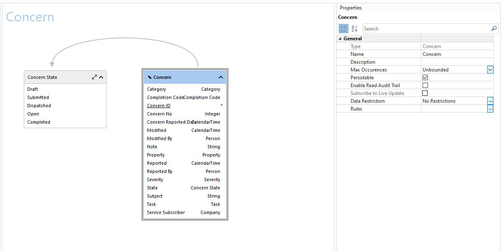
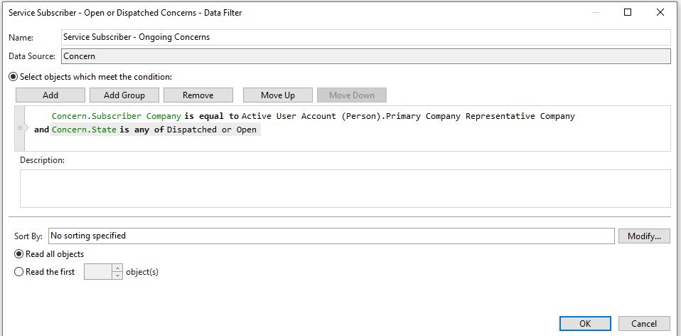
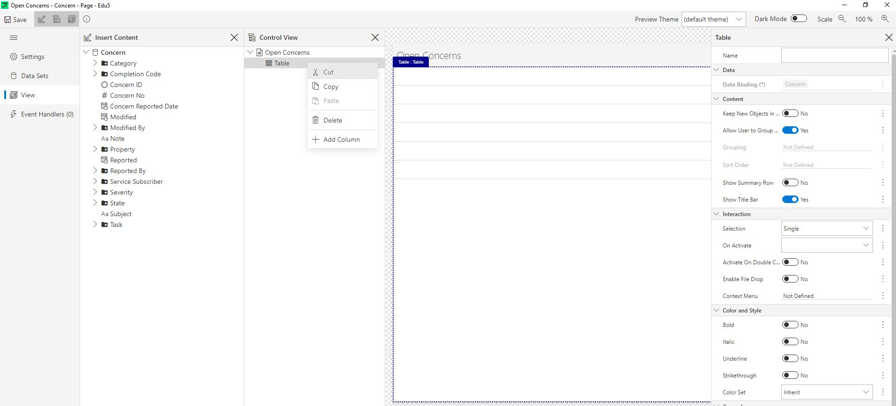

# Create a Concern View for the Facility Management App

## 3.1.1 Create a new Module called Concern and add Data definition
1. In Studio, navigate to User Interaction -> Modules. Note that the existing modules have created a trend of dividing separate sections of the model into data-focused modules, and using the Facility Management module as a functionality-focused module where we collect all relevant pages from other modules. Continuing this trend, create a new data-focused Web Module named "Concern". You can instantly name it by saving once the Module Editor opens for your new module.
2. Now we need to define which data source subset the module will have access to. Under Data Structure, navigate to Data Sources or Data Diagram and add Concern. Leave Max Occurrences as "unbounded", this allows the module to read more than one Concern, for instance for our tabular view. We can restrict the occurrences of the Concern object within each form and view later. Also leave "Persistable" checked, this allows us to add new concerns or alter existing contacts within the module and save the changes permanently. Also add Task as a Data Source. *Note that if you choose to do this in the Data Diagram, you will need to right-click and enable the Object Class as a Data Source after initially adding it. This is because the data diagram can sketch up relationships to object classes that are not used as data sources. Test this by adding Object Class Concern State, without enabling it as a data source. You can differentiate enabled data sources by their blue colour*

  
3. Data Filters: We want to create a few different data filters that can be applied to the Modules User Interfaces, namely: "My Ongoing Concerns" and "My Completed Concerns". The "My" in this settings, indicates "the service subsriber's".

  * Add new Data Filter, named "Service Subscriber - Ongoing Concerns", with Filter Data Source = Concern.  We have 2 criteria we want to filter Concerns based on here - First off; we want the Concern's Subscriber Company to be the same as the logged on user's Primary Company Representative Company. Secondly; we want the Concern status to be Open or Dispatched. You can try to set up this filter without further instructions, or;
  

    
 **Click here for tips** 

  We place the Object or Source we want to filter on the left hand side (Concern.Subscriber Company). This is a datafield available in the Web Module's data structure, so double-clicking (or right clicking and selecting "Select Object or Field") allows you to look in your available data sources for the comparison baseline here. We want to compare the Concern's Company value to the logged in user's primary company. Right click and choose "Select Object or Field" again. Note the Data Sources with different format to your Module Data Sources in the bottom of the "Data Source" list. These data sources are "session based". They can provide information about a logged on user, or error events as they occur. Highlight "Active User Account (Person)" and select "Primary Company Representative Company".
  Add another condition, and set "Concern.State is any of" as the conditional basis. State is a Code Domain - this means that there is a set number of values this comparison can use. Right click on the empty right-hand side, and choose "Select Object(s)", then pick Open and Dispatched from the value list.

    

        
 **Click here to view the finished data filter** 

          
          

  

  * Add new Data Filter, named "Service Subscriber - Completed Concerns" using the same method. **NB! You can clone your first filter and simply alter the name and state-condition.**

## 3.2.2 Create Concern View

1. Navigate to Pages in the Concern module. Add a New Page -> View.
2. Name the View "Ongoing Concerns" and choose Master Data Source = Concern. The reason all views are named in plural, is because their tabular nature indicates that several instances of the master data source will be listed.
3. Start in the Settings section in the top left, and title the View "Concerns" and add Icon "Fluent-Message" (continuing the symbolizing of concernc being communication between the leasing company and the property manager)
3. Navigate to View on the left-hand side and Toggle "Show Control View Pane" in the Ribbon (or click Ctrl+Shift+L). Both in the Control View, and directly in the view editor, you can alter the column arrangement by drag and dropping columns. You can also navigate to the top-level in the table and edit table-level settings, or the top-level in the page and add an action bar (more on that later).
  

4. Drag relevant data fields into the table from the "Insert Content" View, after the first columns you can simply double-click any data property you want added to the table. Add at least Concern No, Subject, Category, Property, Severity and Reported Date. Note that several columns are redundant due to the context, such as Service Subscriber and State - because the view is specifically created for Ongoing Concerns, and will use the "Service Subscriber - Ongoing Concerns" filter. *Note that while you can add Columns by right-clicking in the Control View, this required the data binding to be added to the column after, while dragging properties into the table from the "Insert Content"-section will automatically set data binding on your behalf.*
5. Add some custom formatting. Each column and cell can be formatted and styled by marking it and adjusting settings on the right hand side. Settings can be e.g. Column label, content alignment, filter enabling and text formatting. The default Column width is set to Fit to Content (with header), which is a good fit for columns without very long data types. This ensures that the label will be visible even if the column is empty for a certain subset of data, and can increase readability for the end user. For data properties that can be quite large (such as Subject or Note for Concern), a max width may be wise to avoid a single column taking up too much space.
    * Set Max width = 400 for the Subject-column
    * Alter the "Reported"-columns format to "Relative" (in the Cell-tab). This sets the time to show "3 days ago", in place of a date. Also rename the column Label to "Submitted"
6. Mark the "table" level in the Control View Pane (or select a single column and hit "Esc"). This is where table-wide settings are found. More often than not, the Content and Interaction sections should be customized in some manner. The Content Section lets you group and sort the table based on content. Add sorting on "Concern No" Descending here. This sorts the Concerns in the order they were reported - reversed. We will define Interaction-behaviour after we have a form to represent a single Concern by.

  

### 3.2.2 Add the Concern View to the Facility Management Application
Navigate to the Facility Management Application, and open the Sitemap. Note the setup for Tasks - where you have a group of pages. Within this group, several views with different data filters have been defined. This allows a single location on the sitemap to switch between different views. We would like to use the same setup for Concerns, where Ongoing Concerns becomes the default and Dispatched and Completed are secondary views.
Add a Page and set target to your View named "Contacts", and set an appropriate name and title. The title is shown in the Tab name.

1. Add **Pages** from the link list below the Tasks-section in the sitemap, label it "Concerns" and set Icon to "Fluent-Message".
2. Add a page within the page group, label it "Backlog" and set the view "Ongoing Concerns" as the target. Use the data filter "Service Subscriber - Ongoing Concerns" to restrict the data listed in the app.
3. At the bottom of the Page properties, set the "Backlog"-page as the default for the group.
4. Badge; apply the same data source and filter settings to the page's badge.
5. Save and refresh the app in your browser. Navigate to the Concerns in your sitemap. As the database table is empty, no Companies has any concerns yet.

Now that we can view the table with relevant concerns, we want to be able to view more details about a single contact or even create a new one.

  
