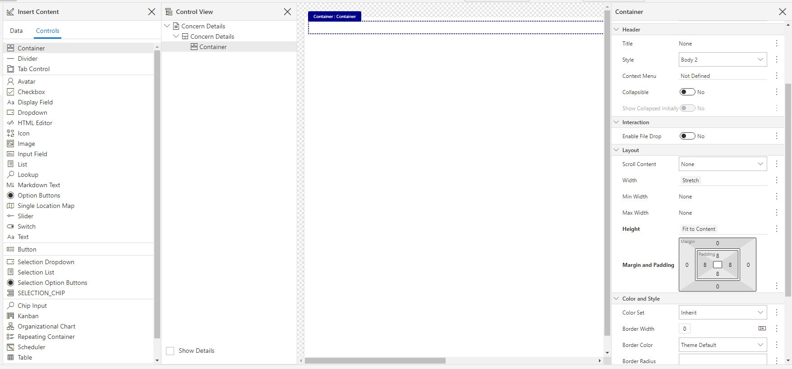
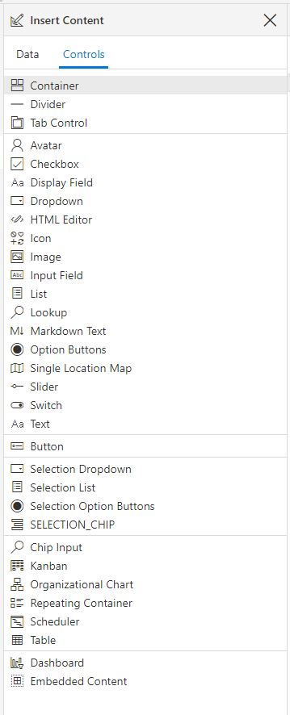
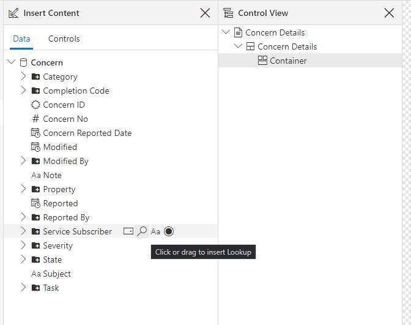
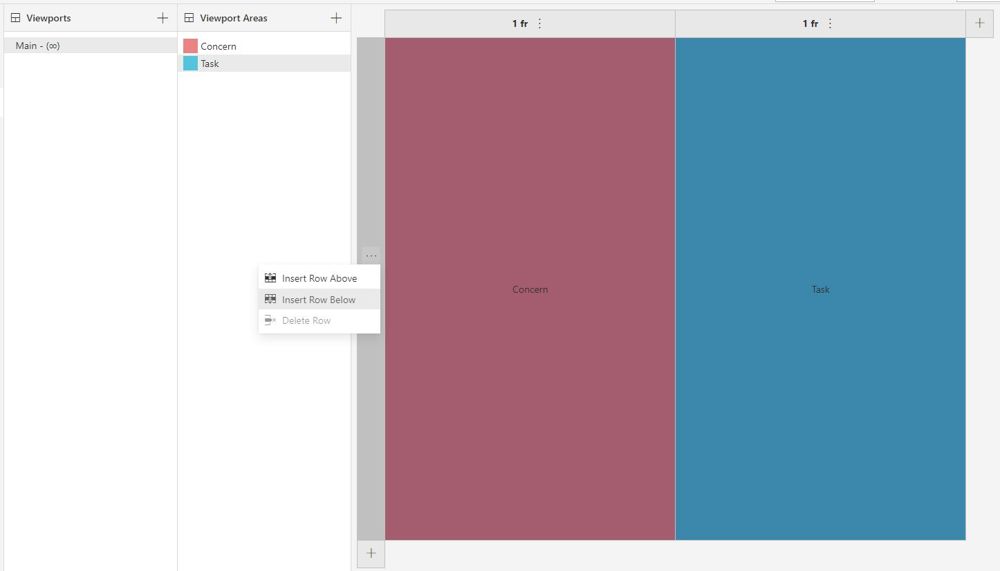
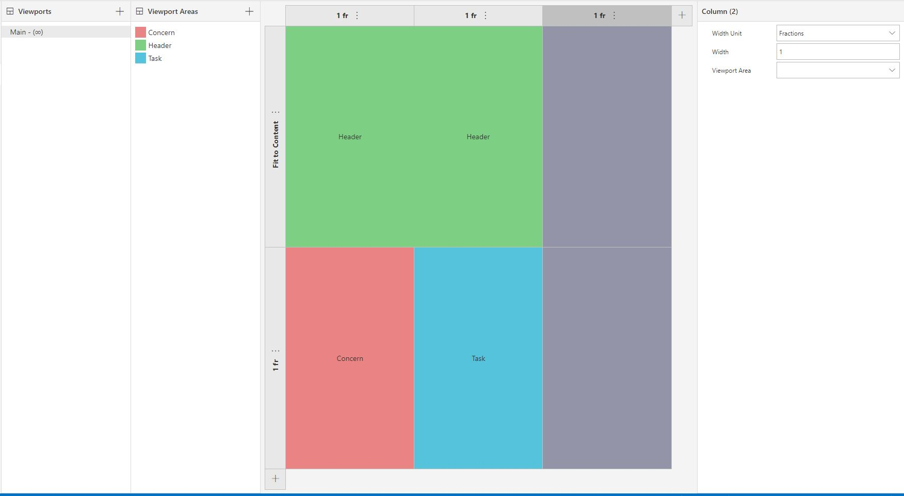
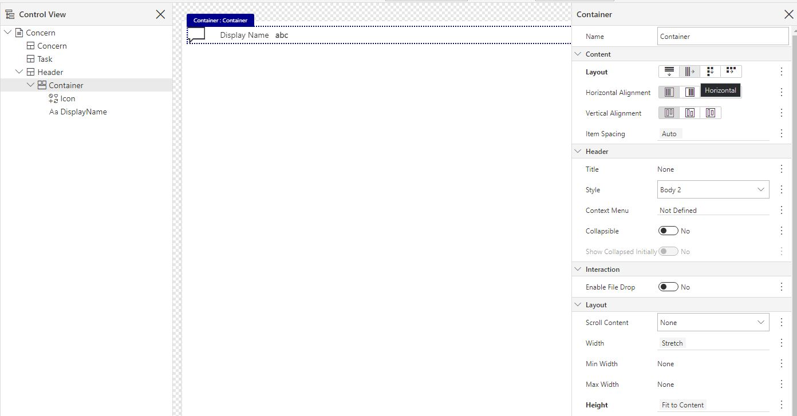

# Exercise 3.2 Forms
In this exercise, you will create your first form.

##  1. Creating a Concern Page

You will now make a Form used for registering a new concern and showing details for existing concerns.

1. In Pages, Right-click -> New -> Form. Save it right away with Master Data Source "Concern" and name it "Concern Details". Pick the default Viewport Layout "None". *Both Components and Pages can be embedded in pages and other modules (if the setting is enabled for the page), and there is no strict rule for when a Page or Component is the correct choice. In this case, we're planning to embed the concern details into a larger Concern page containing the Task. However, we also want the user to be able to add concerns and only needing to input the values in the Concern Details page. Thus, "Concern Details" will also be used as a standalone page, and we decide to place it within the Pages section as a Form.*
2. We want this page to be a part of a larger Concern-page, so head to the Settings and check "Allow Page to be Embedded in Other Pages"

## 2. Data Set setup
3. Data Sets: This is where you add the object(s) from the Module's Data Source selection that you want to show or utilize in the Form. You already defined Concern as the Master Data Source when creating the form. Note that:
   1. We want to be able to send Concern-data into the form and get data back - for instance we can auto-fill location based on the context we activate the form from, and return to a concern view updated with the new data after adding a new concern. This means that the dataset needs to have "Included in Public Interface" activated. Data Sources added in the Public Interface section here, will also be available for input.
   2. The form Data Set "Concern" is restricted to occurrence = "One" by default when it is set as the Master Data Source, which means that only one Concern-object can exist in the Form and this one Concern is always in focus when the form is in use. Occurrences "Many" is used for data sources that you want to list (e.g. in a Table or List etc) within the form, often objects related to the master data source.

## 3. Viewport and Page Layout
4. Viewport: Go to Viewport and rename the Area content to "Concern Details" (double click for edit mode). Viewport Areas are used to create the general layout of the Page, and if your page were separated in a few logical sections, you could determine the page's behaviour on smaller screens through viewports. Concern Details will be a fairly basic page, and we do not need any additional Viewport Areas for this part. Mark the left hand side of the "Contact Details" area (where it says "1fr" for "1 fraction"). In the right hand menu, you can now see some settings for the Row(0). Set Height Unit = Fit to Content.

<ol start = "2">
<li> Navigate to "Form". Toggle the "Show Control View Pane" in the ribbon. You can now see the empty Viewport Area you just renamed. The "Control View" section shows the structure of controls, and can be used to re-arrange data fields and containers. This can also be done by drag and drop within the interface. "Show Details" simply shows more information about the data source and data fields.

</li>
</ol>

## 4. Adding Controls
6. Navigate to "Controls" in the Insert Content section. Add a Container - either by double clicking when the viewport area is highlighted or drag and dropping. You will get a warning in the upper left corner. Click it and read. These are warnings and recommendations from the form designer, and can often be useful to ensure that controllers are displayed optimally. Change the Height of the Container to Fit to Content as the warning suggests. Also, set padding to 8 on all sides to clear some room in the edges of the page.

*Note that the two settings you just altered - height and padding - have become bolded to indicate that the default values have been replaced.*

The second section shows available controls for data fields. These range from default input fields, to schedulers, and to embedding other components or pages.

These can be added to the form and bound to data fields from this Controls-list, but a quicker route follows:
  1. Navigate back to the Data tab in the Insert Content-section.
  2. You can now add data fields to your form, with the data binding pre-defined. Hovering over a data field will show you the available control types for the given data field. Give some thought to the data type and amount of data being displayed when choosing the control type. For instance, radio buttons and dropdown menus are great for small selections of data, but may become overwhelming if applied to the data field for Company with several hundreds of instances. Here, a Lookup may increase user friendliness.

*These are simply suggestions, and you can always return to the Controls-tab to create more specific UX-controls as needed*

7. Add Controls for the following fields; Subscriber Company, Subject, Property, Category and Severity. When choosing between display fields and input fields, give some though to whether the data could be changed at some point. In this case, the form will be used to create new instances so input fields are generally preferable. For a lot of the other forms created, the service subscriber should not be able to alter values, and you'll see a lot of display fields.
8. Save your work and close the window.

## 5. Using Concern Details
In the end, we want to be able to create new Concerns as well as viewing Concern Details in combination with the related task.
We will start by using our "Concern Details" form as a Page in a larger form, before having a look at creating new concerns in the following actions lesson.

1. Navigate to Pages. We want Create a new Form named "Concern", with the same Master Data Source as before - Concern. Pick the "Left/Right Split" for Viewport Layout. Navigate to Viewports and rename the Area contents to "Concern" (left) and "Task" (right) by double clicking. Set the height unit as Fractions for this row. We would like to have a header space that shows the subject of the Concern, that can stretch across both these viewports. Add a new row above the left/right, and a new viewport (use the ... in the row, instead of the + button at the bottom). Keep Height Unit as "Fit to Content" for this row. The viewport row is grey, which means there's no viewport area assigned to it. Add a new Viewport Area and name it "Header" and drag it onto the two viewport spaces above "Left" and "Right". The page we're about to create will have two main columns of information, but for a full laptop size, this will likely not fill a full page. In these cases, we sometimes add an empty column in the layout to the right of the main content.

2. Header; Head to the form view, and toggle the Control view (Ctrl+Shift+L). Mark the header area in the Control View. Set padding to 8 on all sides.
    1. Add a Container and set height to Fit to Content.
    2. Add an Icon control. Set the Icon to "Fluent-Message" - while the property manager may view Concerns as an inbox of potential tasks, the service subscriber considers concerns a communication with the property manager.
    2. Add the "Display Name" as a Display Field. Set the Label value to "None". The Display Name is placed underneath the Icon by default, but we want these side-by-side. Mark the Container above and alter the Content Layout to Horizontal.

3. We often add Pages or Components into a tab control, but content can also be embedded directly into the form. Highlight the Concern Viewport Area. Scroll all the way down to add an "Embedded Content"-control in the Control panel. Select Concern Details as your target, and send the Concern from your view into the data set.

##6. Add Task
4. Navigate to Data Sets in your and add task as filtered dataset. We want Occurences to be set as "One" here - this is because we're only going to include the Task connected to the one Concern we're looking at right now. Set a mandatory data filter through "Objects Related to Another Data Set" that connects the Task to the active Concern's Task in a One to One Relationship.
5. In the viewport Area to the right in your form, add an appropriate short summary of a task.

##7. Mobile Layout
5. Create a Mobile Viewport setup; Navigate back to the Viewports section. Add a new Viewport and choose "Medium" size as the breakpoint. This decides at what screen size the web page will choose this particular layout.  Make the following adaptions to the Phone Layout:
  1. Delete the empty rightmost column, this mostly exists to create an empty space for large screens.
  2. Delete the right column with Header and Task.
  3. Add a row below the "Concern"-Area. Set Height Unit to 1 fraction and add the Task Viewport Area.
If you head back into your Form, you can switch between the Viewports in the action bar on top. Here, you can also check how the form looks in dark mode or another colour theme. You can also test the phone viewport by shrinking the size of your browser.

<table>
   <tr><td><a href="e3.1-view.md"><- Previous</a></td><td align="right"><a href="e3.3-Repetition.md">Next -></a></td></tr>
</table>
