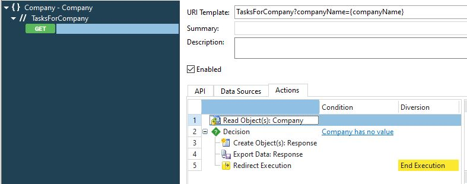
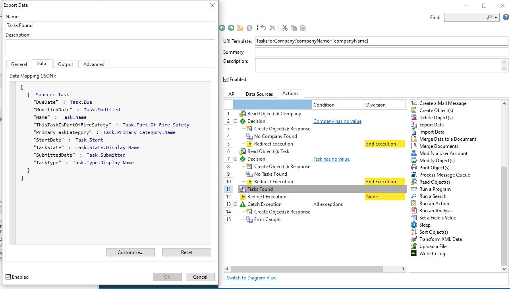
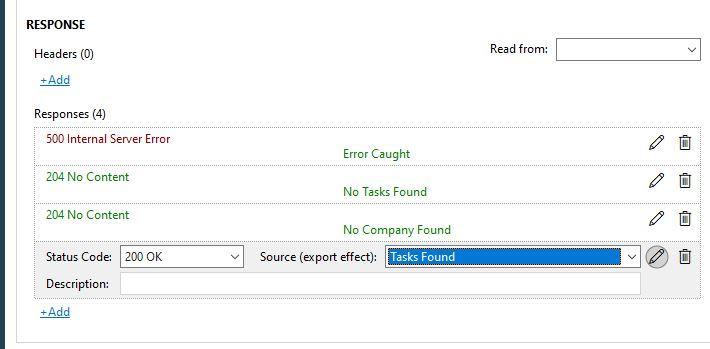
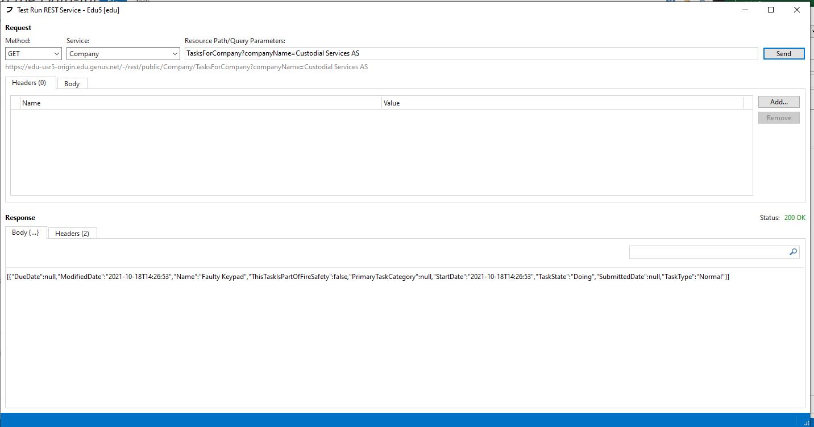

## Exercise 5 - REST Services
**SESSION BY INSTRUCTOR:** *The instructor will give you a brief introduction to the concept of REST Services and how they are set up in Genus*

This is an optional exercise depending on your progress on the exercises. As a minimum, we recommend you to read through it.

REST Services are easily set up in Genus. A REST Service made in Genus is available on the application server so that other applications can call on it to perform the service operations it provides. Perhaps we want an external solution to be able to write something to the Genus Property Management application. In this case we want it to retrieve information.

####1. Create a REST Service "TasksForProviderCompany"

Make a REST-service TasksForProviderCompany that retrieves all Tasks associated with a given Company that are in state "To-Do" or "Doing". The input of the service should be the name of the company, and the response should contain the most important fields for a Task.

1.	Add a new REST service

   Find REST Services in the Application Services section in the Navigation Pane, right-click and select New. Specify Name and Path Segment (e.g. type “Company” in both). Save.

2.	Add a Resource

   Right-click on the REST Service node in the tree structure view and select Add Resource. Under Request, specify a Path Segment (Name = “TasksForProviderCompany”, Type=Literal) either by modifying the Segment that is already there by default, or by adding a new (and removing the default)

   *Note: At least one Path Segment is required to identify the resource.*

3.	Add a Method GET

   1.	Right-click on the Resource node in the tree structure view and select Add GET. Since we want to input a company name, add a Query Parameter (Name=”companyName”, Type=String, Required=TRUE) under Request. Later, we will also specify various responses under Response.
   2.	Navigate to Data Sources, and add the following objects:

      * Company: Company object to which the input name is referencing (Max Occurences=One).
      * Tasks: All Task objects associated with the provided Company (Max Occurences=Unbounded).
      * Response: Local object used to keep the response/output text of the service (Max Occurences=One). Add a field “requestText” (Type=String).
      * Request: Local object used to maintain the request/input of the service (Max Occurences=One).  Add a field “companyName” (Type=String).

      *Note: Go back to the API-tab and choose Save To: Request (under Request).*

   3.	In the Actions-tab, you will have to define the logic of the REST Service. First, you will have to find the Company that corresponds to the name provided as input (request). If a matching company does not exist, a suitable response should be generated (e.g. “Company not found”) and this response should be exported to the response before redirecting the execution to make it end.
   

       
 **Click here to view the sample flow** 

     
   

   On the same note; if a Company is found, all Tasks in state "To-Do" or "Doing" associated with it (Task.Provicer Company) should be read. If there are no Tasks, a suitable response text should be generated (e.g. “No ongoing tasks found for company”). However, if there are Tasks, they should all be exported as a response. Customize the response to not include all fields (e.g. remove Completed date etc) and to contain names rather than IDs. At the end of the Actions sequence, catch all exceptions and let the error message be the response of the service.

   In order to set the correct HTTP response in case of an unknown error, use the "Set a field's value" effect to set the "Action orchestrator's" HTTP Response field to a suitable HTTP-response response (i e 500: internal server error in case of a crash).

      *Guidance: Use the Create Object(s) effect to create response texts (Response.responseText), and the Export Data effect to map objects to Json format and output them as Response Message Body. You can edit the response by clicking Customize within the Data-tab of the Export Data effect. You will need to assign names (e.g. the response text which they represent) to the Export Data effects to be able to recognize them.*
      

          
 **Click here to view the full flow and task export** 

        
      

   4.	Go back to the API-tab and specify which responses to include. You should add 4 different responses in total: “Company not found” (Status Code=”204 No Content”), “No tasks found for company” (Status Code=”204 No Content”), Tasks found” (Status Code=”200 OK”) and “Something went wrong (Status Code=”500 Internal Server Error”).

      *Comment: The Description property is just metadata, used for describing the request/response.*

    

        
 **Click here to view the responses** 

        
    

4.	Right click the REST-service and add security. We're going to verify that the REST-service works as expected in the Desktop solution. Start (or restart) the desktop solution.

   *Guidance: After starting, or restarting the Desktop Client, click File - > App -> Call a REST Service. Select the service that you made and type in the Resource Path and a Query Parameter (e.g. “TasksForProviderCompany?CompanyName=Eletrical AS”, or “TasksForProviderCompany?CompanyName=Custodial Services AS”). Check the response in the lower window.*

   

<table>
   <tr><td><a href="exercise-11-2.md"><- Previous</a></td><td align="right"><a href="exercise-15.md">Next -></a></td></tr>
</table>
