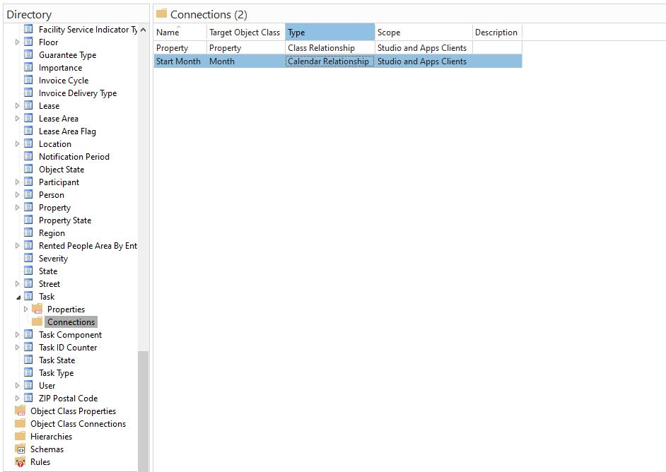
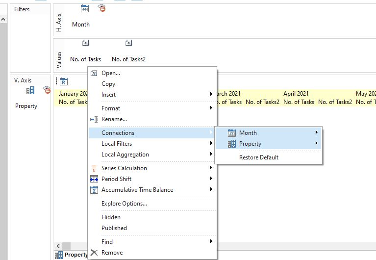
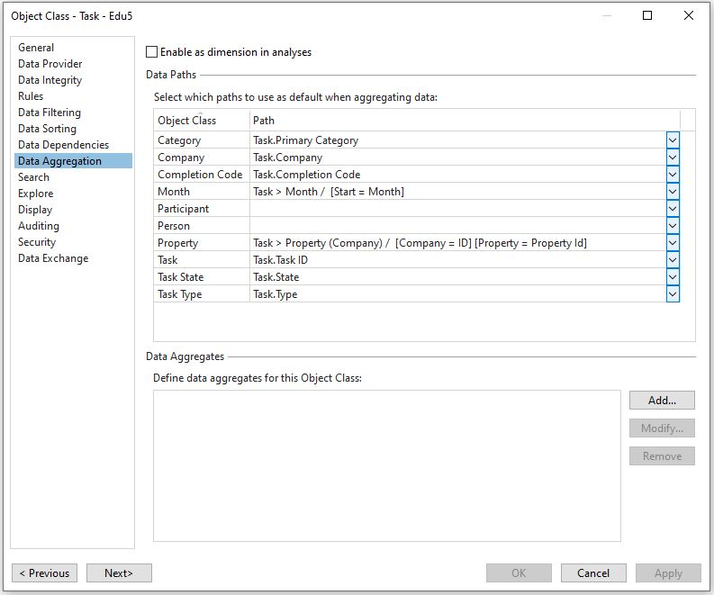

# 7 Analysis

We've had a look at Dashboards and Data Marts in "Analytics and Insights" in Genus Web.  In addition to this, we have "Analysis" - a reporting tool available in Genus Desktop which, in combination with Mail Merge, can be used to build pdf-reports. The report part is mainly used for setting up predefined reports that benefits the end user.

The tool can also be made available from the client, so that dedicated groups of end users can set up or modify reports/analysis themselves. Or used in generated file reports

You will now go through a couple of exercises concerning the creation of reports. **A brief summary of the report functionality of Genus Discovery is described here:**

A new report is created from Genus Studio -> Discovery -> Reports -> New, or in the "Analytics and Insights" navigation in Desktop.  The tool's structure is logically set up as shown below:

To make an Object Class available as a dimension in a report, you must specifically assign this feature to the Object Class (right-click on the Object Class -> Open -> Data Aggregation). Likewise, you will have to check the "Enable as Measure" option (right-click on the Object Class Property -> Open -> Data Aggregation) if you want to use an Object Class Property as a Measure for calculating sums, counts, etc (ref Tasks's No Of Tasks property). **Note that this is done already, and is defined per Object Class Property**

In addition, you will have to specify how to group No of Tasks per month, as this connection can be defined using any of the Date-fields on the Task. You will have to determine which links to use ("Connections") in the report.

Connections that will become available in the report, and hence possible to choose from, are defined under Object Classes in Studio:

*Note: You don't have to specify the link between Task and Company, as Task has a Company-field directly. However, if No of Activities is to be grouped by for example Property, you will have to add a Connection from Task to Property through Company in the list shown above. Note also that when you are working in Genus Discovery (reports), you are working in the client. Accordingly, if you for example add a new connection to an Object Class, you will have to restart Genus Desktop in order to make the Connection available for creating reports and publish to end users before they are able to run reports using this connection.*

In the report, you can set up connections from No of Task to the "Month" and "Property" dimensions by right-clicking No of Tasks -> Connections. *There is a shortcut for creating calendar-based connections in Genus: Right-click on a Date type in the list of Object Class Properties -> Create Calendar Connection.*
 

You can also define "Local Filters" on objects in the Report, if you somehow want to restrict the data (e.g. you want a report with numbers based on Tasks having State="Completed" only).

Default Connections are defined on the Task Object Class, in "Data Aggregation". This saves you a lot of manual connection, when you can expect that these connections are relevant. Default connections can be set both for directly connected fields, and inferred connections defined in the Connections-list. Note that these connections can always be overridden in each Analysis created.

 

####1. Create a report "Tasks Started per Property/Month YTD".
The report should count the number of completed Activities per Month per Company Speciality so far this year. It should also sum the number of activities both horizontally and vertically, and be presented to the end user either as a table or as a line chart.

*Tip: You will have to set up a new Connection from Task to Property (through Company). You also need to make object class Property available as a dimension in reports (i.e. check the "Enable as dimension in reports" option found in the object's Data Aggregation properties tab).*

*In order to sum data, right-click on "No of Tasks" in the report -> Series Calculation and choose to sum over both Month and Property. Check "Calculate intersections" in both sum functions to get the "sum of sums" (i.e. sum of activities for all Properties for all months YTD) in the bottom right corner:*

*You can control which buttons to show in the report by checking/unchecking them in the "Buttons" menu (upper right). Allow the user to shift period back and forth. In addition, check Explore, Table, Line (line chart) and Filter Pane.*

####2. Create a report "Cost per Company last 3 months".
The report should have measure "Cost" and dimensions "Month" (select last month and two months back) and "Company". Only Tasks of Type="Normal" and State="Closed" should be shown, and the connection against Month should based on Start Date.

*Tip: You need to make sure that object class Company is available as a dimension (Data Aggregation), and that Task.Cost is available as a measure with Method="Sum".*

####3. Add report shortcuts to the Navigation Pane.

All reports (given that you have the rights to see them) are available from the Discovery menu in the client. In some cases, however, it can be useful to create shortcuts to reports in the Navigation Pane (e.g. reports are of high importance or are frequently used). Take a look at the provided solution if you want to see how reports have been published there.

#### 4. Use the Report in a Mail Merge
See the "Mail Merge" exercise.

In the "Merge Data to Document"-effect, test adding the analysis in the "Other Datasources"-tab and add a mail merge field "HTML:AnalysisName"
