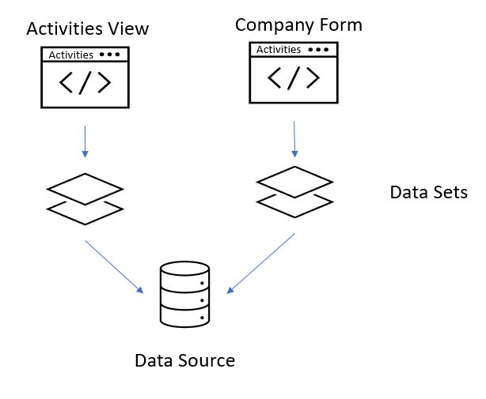

# User Interfaces - Web Terminology

Before building web applications in Genus Studio, there are some concepts and terminology you should be familiar with.

## Module
Modules are a way to split the functionality of your App Modelinto separate parts. For example, in a CRM solution, you may create one module for sales management, and another for customer and product management. Genus Studio does not enforce any kind of module structure. It is up to you to choose how to split the functionality into different modules.

The purpose of modules is to avoid too tight coupling between parts of larger [Apps](#app), or common app models including many apps. That means, there should be low coupling between modules and high cohesion within them - elements within a module should have a higly relevant connection to the other elements within the same module. Modularity also allow for larger teams of Business Engineers working together on a common app model, in our example with seperate modules for sales, customer and product manager; 3 business engineers could be working on their own module and simultaneously contribute to the resulting app. Well-chosen modules bring together elements of the common app model with particularly rich conceptual relationships. This high cohesion of objects with related responsibilities allows modeling and design work to concentrate within a single module.

Modules are interchangeable and can be used for assembly of apps of differing size, complexity, or function. Pages and components within a module can be defined as public or private. Public pages and components can be reused in other modules. In addition, all public pages can be reached from the sitemap within an app. In a mature common app model you will probably reuse existing modules when composing a new app.

Within a module you can define the following elements:

A Module is a named collection or boundary containing the following elements:
* [Data Sources](#data-diagram-and-sources): The module is restricted to the data sources explicitly selected. None of the elements below can read, change or delete data outside of the Data Source space.
* [Pages](#page): A visual presentation of data for displaying, editing and deleting data.
* [Components](#component): An assembly of UI controls that can be reused in Pages or other Components.
* Client Actions: A sequence of effects initiated by an event in the user interface, and executed on the web client
* Server Actions: A sequence of effects initiated by an event in the user interface, and executed on the server - for instance doing more complex database loopkups based on related objects and logged in user.
* [Data Filters](#data-filter): Restrictions on data that are guaranteed to be SQL compatible at the time of definition. In a future version of Genus, it will be possible to define such filters at the place of use, effectively removing the need for explicitly named Data Filters here.
<!-- TODO: Replace description when data filters are obsolete -->

The elements above cannot exist outside a Module, i.e. all elements above must be connected to a single Module.

## Data Structure

In this section, you select the parts of the complete data model that pertains to this particular module.

### Data Diagram and Sources

In both the Data Diagram and the Data Source section, you can define the partial, or restricted, data model that is relevant to this particular module. The Data Diagram is the same visual representation we used when we first added the Contact Object Class, and the Data Sources-section is a more tabular visualization of the same information.

### Data Filter

A Data Filter is a criteria for restricting the selection of objects in a Data Set, and can be reused throught the module. These are often based on the logged in user; such as "My Companies".

## Page
A Page is a visual presentation of data for displaying, editing and deleting data. All Pages fall into one of three categories - View, Form and Canvas:

* [View](#pages-view): A collection of data presented in a tabular format used for presenting more than one object, but also searching among objects.
* [Form](#pages-form): Presents data in a schematic layout typically used for presenting and editing a single object in focus, along with objects related to the main object.
* [Canvas](#pages-canvas): For solving problems involving multiple object types of equal importance, where no one object is singularly in focus.

A View can be used as a default presentation of a collection of objects. A Form can be used as a default presentation of a single object. A Canvas cannot be used as a default presentation, because there is no main data source in focus.

A Page can be used in more than one [App](#app). As such, it is often useful to think of an App as a collection of Pages.

A Page always belongs to a [Module](#module), and all data for View, Form and Canvas are limited to the Data Sources made available through the Page's Module (and any data restrictions on those Data Sources).

### Data Set
Data Sets fall into one of two categories:
* **Filtered Data**: These are subsets of data from the Page's [Module](#module) Data Sources and are filled when a Page opens.
* **Refined Set**: These are criteria based subsets of data from either Public Interface Data Sets, Filtered Data or Writeable Sets. Refined Sets are read only and contains all objects which satisfies the given criteria at any time.

Within a Page you can determine which data the Page should operate on by specifying:
* A **Public Interface**: A Public Interface consists of [Data Sets](#data-set) that can received data from a context "outside of" the Page. These Data Sets can be filled when a Page opens.
* **Private Data Sets**: Private Data Sets, on the other hand, are internal to the Page and not visible outside the Page.

All Data Sets (whether public or private) need to fall within the data restrictions set for the Data Sources given by the Page's [Module](#data-diagram-and-sources). Data Sets defined within a page can have various filters or restrictions on which data you can *view* in a particular page, but ll pages are still referring to, or mirroring, the same data source in the end:

### Pages: View

A View presents data in a tabular format like a Table or Repeating Container.

A View also supports search and pagination. Pagination is the process of retrieving and presenting data in chunks, where each chunk continues where the previous finished.

A View has a Master Data Set which connects to a Data Source. A View can be used as a default presentation of a collection of objects for a Data Source.

If you are a first time reader well accustomed to pre-Oak versions, think of **Views** as the successor of pre-Oak **tables**. However, the table UI control underneath Views is new and with differences compared to pre-Oak tables.

Note that Repeating Container is not implemented yet in Oak as of April 2020.

### Pages: Form

A Form presents data in a schematic layout, where you can place traditional UI controls and [Components](#component) rather freely.

A Form has - similar to [View](#pages-view) - a Master Data Set which connects to a Data Source. A Form can be used as a default presentation of a single object (and any related objects) for a Data Source.

Unlike a View, you can do the following inside a Form:
* Specify a [Viewport]. A Viewport divides your Form into a grid of rows and columns.
* Reuse [Components](#component). Components are assemblies of UI controls reusable across all types of Pages.

If you are a first time reader well accustomed to pre-Oak versions, think of **Forms** as the successor of pre-Oak **forms**, but with some improvements and some differences.

### Pages: Canvas

Both View and Form are focused on specific tasks and both optimized for handling a single Data source (through the concept of a Master Data Set). A Canvas does not have a Master Data Set, and thus cannot be used as a default presentation of an object.

Not having a single Master Data Set, makes the Canvas suitable for solving problems involving multiple object types of equal importance.

### Sitemap

A Sitemap provides access to destinations like [Pages](#page), Analysis and URLs.

A [Sitemap](#sitemap) consists of a hierarchical structure composed of Areas, Groups and Links. Area is the topmost level, followed by Group and then Link. However, a Link does not need to be connected to a Group, thereby making Group an optional level in the Area - Group - Link hierarchy.

A Link points to an Analysis, an URL or a set of one or more [Pages](#page).

If a Link points to more than one [Page](#page), the user can choose (switch) Pages at run time. This is useful for Pages users change between quite often, instead of adding the Pages as new Links to the Sitemap (and thereby "cluttering" the Sitemap).

You will probably most often link your Links to Pages of type [View](#pages-view), which presents data in a tabular format.

## Component
A Component is an assembly of UI controls that can be reused in [Pages](#page) within the same [Module](#module) or in other Modules.

Components can be of the three same types as Page, namely Form, View or Canvas, and the meaning of these three types are similar, i.e.:
* [Canvas](#pages-canvas): For solving simpler or more unstructured problems than provided by View or Form.
* [View](#pages-view): A collection of data presented in a tabular format used for presenting more than one object, but also searching among objects.
* [Form](#pages-form): Presents data in a schematic layout typically used for presenting and editing one object (and any related objects).

Components - unlike Pages - cannot be used in a [Sitemap](#sitemap) (and thereby not in an [App](#app)), but has to be placed inside other Pages or other Components. In such respect, Component is a concept on the same level as UI controls, which also can be placed in the content area of Pages or Components. This means that a Component can contain other Components.

A component belongs to a [Module](#module), but can be reused in other Modules, i.e. by Pages and Components in other Modules.

In summary, Component is a powerful building block in your user interface. Special-built Components rich of end user functionality can be reused in other parts of your solution, and thus reduce the need for remodelling.

## App

An App is a named [Sitemap](#sitemap), which provides access to [Pages](#page) and more, to support a business process or function.

An App has fields like Name, Title and Path Segment.

The Path Segment is the last part of an App's URL, to be able to open the App directly without going through the Start Page.

A Sitemap - and thereby also an App - has a Landing Page, which is the [Page](#page) that opens by default when you launch the App.

 
 
