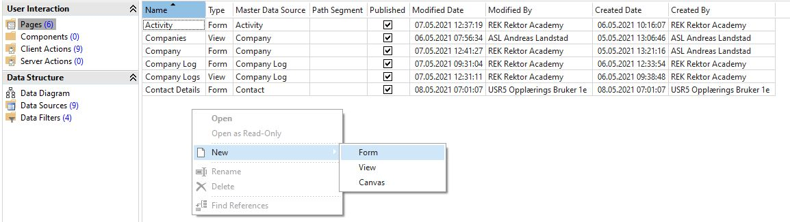
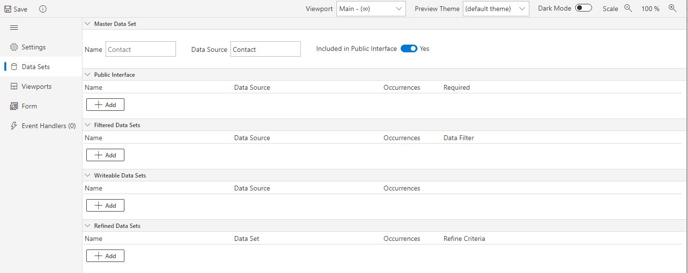
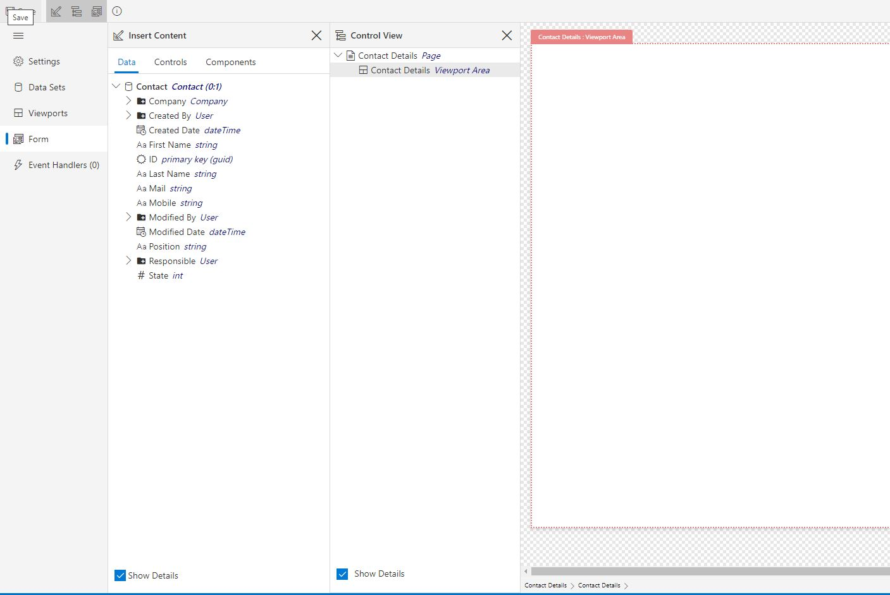
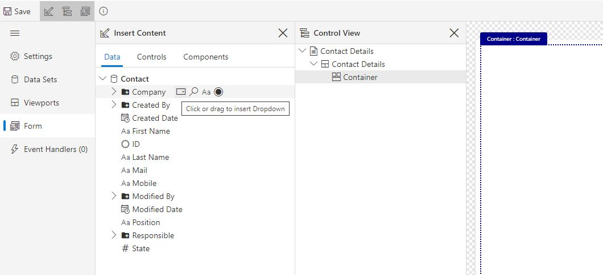

## Exercise 3 - Forms

You will now make a Form for registering and opening customer Contact information.

### 3.1.1 Create Contact Page
1. In Studio, navigate to User Interaction -> Modules. Access the Company module. Under Data Structure, navigate to Data Sources and add Contact. Leave Max Occurrences as "unbounded", this allows the module to read more than one Contact. We can further restrict the occurrences of the Contact object within each form and view later. Also leave "Persistable" checked, this allows us to add new contacts or alter existing contacts within the module.
2. In Pages, Right-click -> New ->  Form. Save it right away with Master Data Source "Contact" and name «Contact Details». Pick the Default "None" for Viewport Layout.

### 3.1.2 Data source setup
3. Data Sources: This is where you add the object(s) that you want to show or utilize in the Form. You already defined «Contact» as the Master Data Source when creating the form. Note that:
   1. We want to be able to send Contact-data into the form and get data back. This means that the dataset needs to have "Included in Public Interface" activated. Data Sources added in the Public Interface section here, will also be available for input.
   2. The form Data Source «Contact» is restricted to occurrence = "One" by default when it is set as the Master Data Source, which means that only one Contact-object can exist in the Form. This is required in order to allow the properties of Contact to be shown in fields. Occurrences "Many" is used for data sources that you want to list (e.g. in a Table or List etc) within the form.

#### 3.1.3 Viewport and Page Layout
4. Viewport: Go to Viewport and rename the Area content to "Contact Details" (double click for edit mode). Viewport Areas are used to create the general layout of the Page. Contact Details will be a fairly basic page, and we do not need any additional Viewport Areas for this part. Mark the left hand side of the "Contact Details" area (where it says "1fr" for "1 fraction"). In the right hand menu, you can now see some settings for the Row(0). Set Height Unit = Fit to Content.
5. Navigate to "Form". Toggle the "Show Control View Pane" in the ribbon. You can now see the empty Viewport Area you just renamed. The "Control View" section shows the structure of controls, and can be used to re-arrange data fields and containers. This can also be done by drag and drop within the interface. "Show Details" simply shows more information about the data source and data fields.

#### 3.1.4 Adding Controls
6. Navigate to "Controls" in the Insert Content section. Add a Container - either by double clicking or drag and dropping. You will get a warning in the upper left corner. Click it and read. Change the Height of the Container to Fit to Content as the warning suggests. The second section shows available controls for data fields. These can be added to the form and bound to data fields here, but a quicker route follows:
  1. Navigate back to the Data tab in the Content-section.
  2. You can now add data fields to your form, with the data binding pre-defined. Hovering over a data field will show you the available control types for the given data field. Give some thought to the data type and amount of data being displayed when choosing the control type. For instance, radio buttons and dropdown menus are great for small selections of data, but may become overwhelming if applied to the data field for Company with several hundreds of instances. Here, a Lookup may increase user friendliness.
7. Add Controls for all fields except the ID. When choosing between display fields and input fields, give some though to whether the data could be changed at some point. For instance, if a Contact changes email or moves to a different Company.
8.
  Save your work and close the window.

  

#### 3.1.5 Using Contact Details
As an end result, we want to view Contact Details in combination with related activities.
We will start by using our "Contact Details" form as a Page in a larger form.  

8. We want Create a new Form named "Contact", with the same Master Data Source - Contact. Pick the Default "None" for Viewport Layout. Navigate to Viewport and rename the Area content to "Contact". Keep the height unit as Fractions here (due to the main control being the tab control, this is required to view content).
9. Go to Form, and navigate to Controls. Add the container "Tab Control". Using the Tab Control allows us to tab content, and add Pages from the module. Set the Tab Control height to Fit to Content.
10. Go to the Tab Control Settings at the right hand side. Click on Pages under "Content". Add a Page, and set the Target as the "Contact Details"-form you just created. Name the page "Contact Details".
11. We need to define the data filter which informs your "Contact Detail" form of what data to display. Click on "No filters defined" and then click on the menu. Choose "Transfer All" and "Contact (0:1). Because both forms have Contact as their Master Data Source, they both contain maximum one instance of Contacts and the filter can simply transfer all Contacts from the form this instance.

<table>
   <tr><td><a href="exercise-02-2.md"><- Previous</a></td><td align="right"><a href="exercise-03-2.md">Next -></a></td></tr>
</table>
