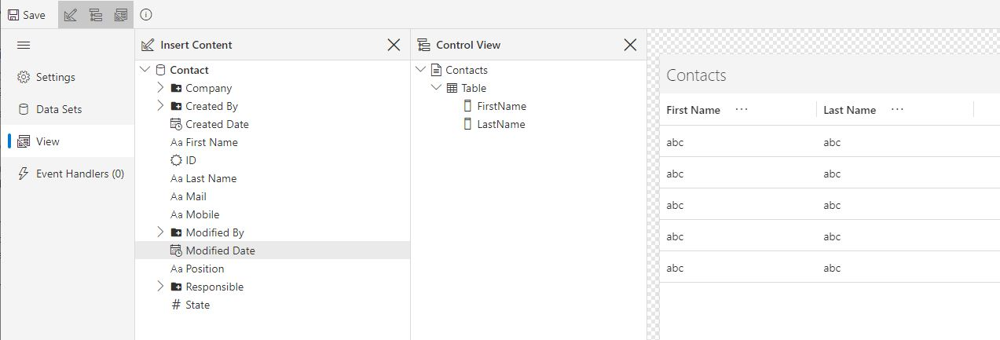
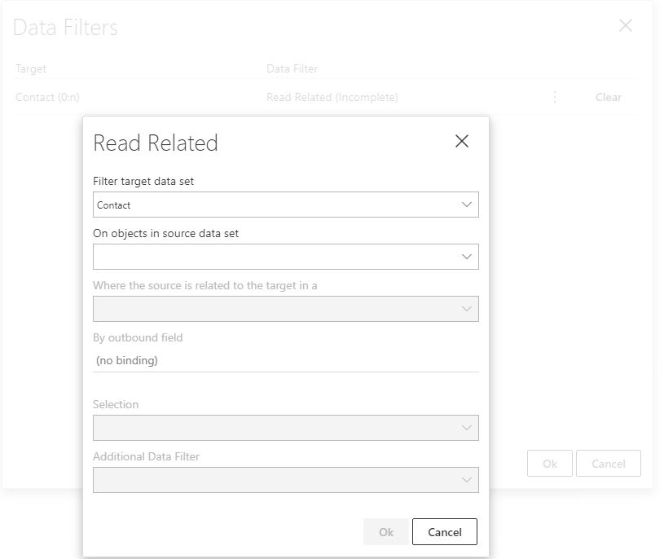

## Exercise 3.2 - Forms

You will now add a list to the Company-form that shows all associated Contacts. You will also make actions to create new Contacts and open existing ones.

### 3.2.1 Create the Contact View

1. Navigate to Pages in the Company module. Add a New Page -> View.
2. Name the View "Contacts" and choose Master Data Source = Contact.
3. Navigate to View and drag relevant data fields into the View. Each column and cell can be formatted and styled by marking it and adjusting settings on the right hand side. Settings can be e.g. Column label, content alignment, filter enabling and text formatting. The default Column width is set to Fit to Content, but can often benefit from being changed to Fit to Label and Content (this is altered in the Column-tab on the right hand side, when a column is highlighted).
4. Toggle "Show Control View Pane" in the Ribbon (or click Ctrl+Shift+L). Both here, and directly in the view editor, you can alter the column arrangement by drag and dropping columns.

  

### 3.2.2 Add the Contact View to Company
4. Navigate to the "Company"-form -> Form.
In the lower section, mark the Tab Control with Logs. Click on Pages in the right hand Tab Control edit.
Add a Page and set target to your View named "Contacts", and set an appropriate name and title. The title is shown in the Tab name.
5. Click the data filter and the menu for the Contact data source. Choose "Read Related".
6. We want to read Contacts for the single Company contained in the Company Form. Select to filter objects on the Company source data set. Because one Company may have several Contacts, it is a One to Many Relationship (One Company and many Contacts). Make the filter read Contacts related to the Company by defining the connection between them in the "outbound field in target" section. This defines the relationship required between the Company from the Form and the Contact list.

7. Save and refresh the app in your browser. Navigate to a Company. We can now see the Contact Tab, at the bottom of the Company page. As the database table is empty, no Companies has any contacts yet.

8. Now that we can view the table with relevant contacts, we want to be able to view more details about a single contact or even create a new one.

  

<table>
   <tr><td><a href="exercise-03-1.md"><- Previous</a></td><td align="right"><a href="exercise-04.md">Next -></a></td></tr>
</table>
