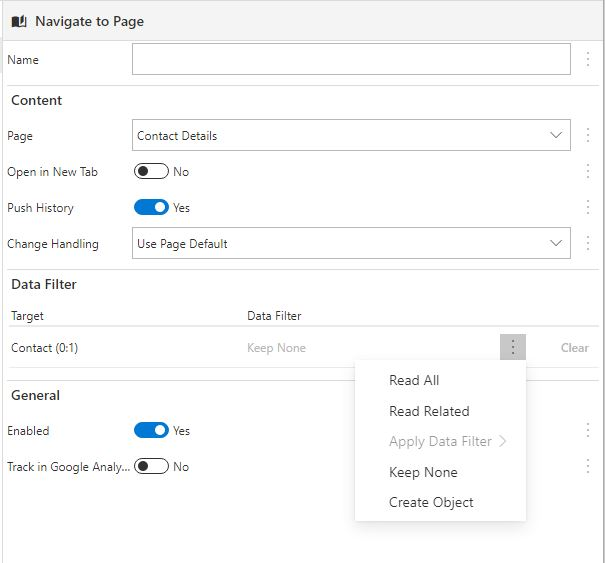
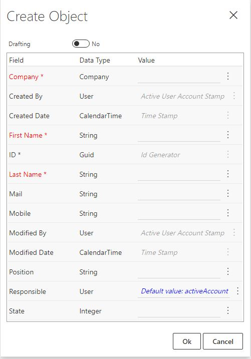
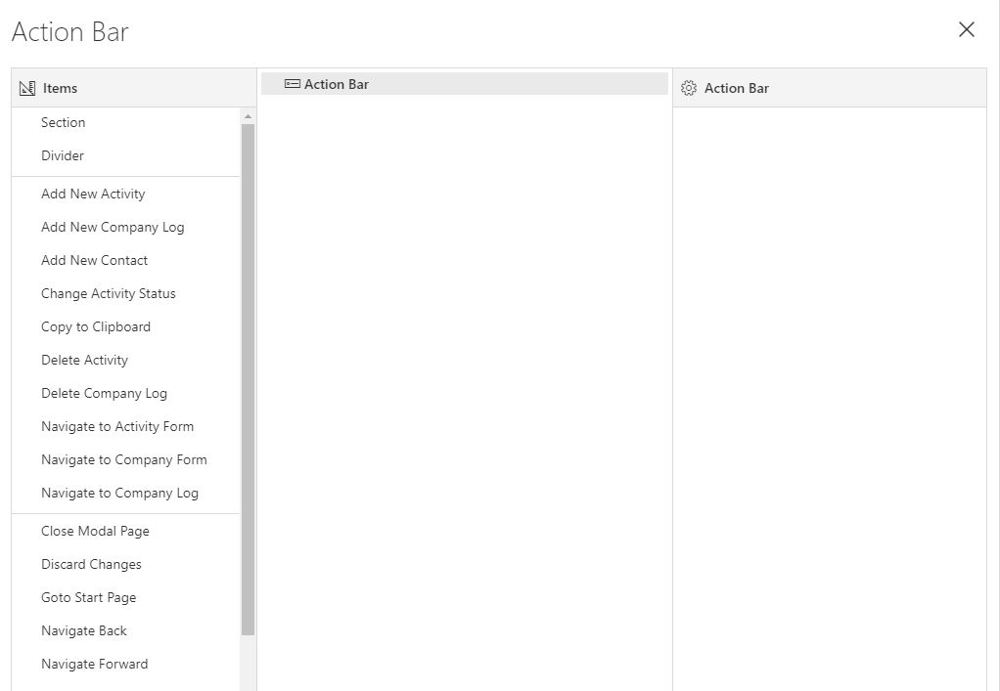

## Exercise 5.1: Actions and Events

### 5.1.1 Create Action for New Contact
In order to create a new Contact, we need to create a Client Action which creates a new Object and allows for user input. This action will be available within this module.

1. Navigate to Client Actions and add new, name it "Add new contact".
2. Go to Action Flow. Navigate to "Effects" on the left hand side. Add a Scope Block by double clicking or dragging it into the working area.
Now we want to Create a new Contact which will be edited in the "Contact Details" Form we created initially. The Form is a type of Page, and we add a "Navigate to Page"-effect into the scope. Select Contact Details as the Page.
3. In the Data Filter-section, click the menu and select "Create Object". Some values here are preset, and some must be given as input. Some can be left blank for the user to fill in and some, like State, should have default values (State = active) which can be edited by the user later. Note that Company is mandatory and blank. As we plan on trigging this Action from the Company form, we will know which Company we want to fill inn here and should send it in as input to the action.

  

4. Navigate to Data Sets and add a Data Source for Company in the Public Interface section. Keep Flow set to In, since we want to receive this information *from* the Company Form. The Company Data Source does not have to be Required. We may want to trigger this action other places within the Company Module where the Company is not pre-defined from context. In these cases, Company value can be set within the "Company Details" Form, along with values such as first name and last name.

5. Return to Action Flow. Re-open the "Create Object" data filter. In the menu for the Company field, choose Select Field and choose the Company data source you just added.

6. Save and close.

  Create Object           |  Data Source selection
  :-------------------------:|:-------------------------:
    | 

<!-- 

  
  

 -->

## The Action Bar and Context Menu
Both Forms and Tables can get a user friendly menu structure through the Action Bar and Context Menu. The Action Bar is a menu structure that most users are familiar and can be grouped similar to other Microsoft Office-products (here named Ribbon and styled slightly different). The Action Bar is placed on top of Pages. Actions can be run from the Action Bar, and one can use Context to show different menu elements for different parts of the interface (when navigating). Context menus are available for rows in Views, as well as some Controls (such as Kanban Cards and Tables), the same editor and principles applies here.

In this exercise, you will use the Action Bar and Context Menu functionality. Both can enhance the user's learning and understanding of a new display (i.e. Form or Table), as relevant actions are made clearly visible.

With a well-defined Action Bar and Context Menu, the user can quickly browse and categorize available actions and get a perception of what the form/table offers in terms of functionality. Consequently, the user gets an increased feeling of control.

To create a well-functioning Action Bar or Context Menu, it is important to utilize all the customization-options offered. By choosing meaningful groupings of commands (Sections), symbols, texts, screen tips, conditional enabling and conditional visibility you can make the life of the user much simpler. For example, you should always try to highlight important and frequently used actions. Below, we start with some basic Action Bars and Context Menus.

### 5.1.2 Utilize Action to Create New Contact

6. Re-open the Contacts View. Navigate to View, open the Control View (Ctrl+Shift+L) and mark the top level - Contacts.
7. In the Page-section on the right hand side. Click "Action Bar". Here, you can see built-in actions, as well as the Client Actions defined in the Module. Select "Add New Contact", set the label to "New" and an appropriate Icon (e.g. Basic-Contacts" or "Basic-AddButton". In the Data Exchange, we can see the Company data source defined in the Action. In order to send data into the Client Action, we need to define a corresponding data source in the View.
8. Close the Action Bar Editor and navigate to Data Sources. Add a Public Interface Data Source for Company. As in the View, the Data Source should be single occurrence and not Required.
9. Return to the Action Bar editor. Mark the "New"-action and click the Data Filter. Set the newly defined Company Data Source as input. While we're here, add another action to the action bar. From the built-in actions, select "Save changes". Rename to "Save" and set the icon "Save-fluent". Save and exit.

  

10. Refresh the app in your browser. Navigate to a Company, click the Contacts-tab and Add New. As you can see, the Company field is already filled in. Add First and Last name, and optionally email or mobile.

11. When you return to the Company page, we see the new Contact in the Contact Tab. However, nothing happens when we click the row. We need to add functionality for showing Contact information when a row is activated/clicked.

### 5.1.3 Open Contact Information
12. Return to the Client Actions-section and create a new one named "Navigate to Contact". In Action Flow, add the "Navigate to Page"-effect. Now we need a data source to filter into the Page.

13. Navigate to Data Sets and add Contact as a Public Interface Data Source. Set Occurrense to One and Required as Yes. If we do not have a Contact to show, we do not want to navigate to the Contact page.

14. Add the Contact Data Source to the Data filter for the "Navigate to Page"-effect by transferring all.

15. Return to the Contacts view. Mark the Table-level in the Control view (optionally: mark a column and press esc).

16. On the right hand side Navigate to the "On Activate"-dropdown. Select the Client Action you just created "Navigate to Contact"

17. Set the data exchange to Contact (0:n) from the view. The view will read the correct Contact/Row from context.

18. Save and refresh your browser.
19. Navigate to your newly created Contact via Company.

### 5.1.4 Delete Contact
1. Add a new Client Action "Delete Contact" in the Company Module. Define a Public Interface Data Source for Contact. The data source should be input, max occurence One and Required.

2. In the Action Flow, add the Effect "Delete Objects" and set data binding to the Contact data source.

3. Return to the Contact View in the Company Module. Highlight the Table-level in the Control View (Ctrl+Shift+L). Navigate to "Context Menu" on the right hand side.

4. Add the newly created "Delete Contact" item to the Context menu. Set Data Exchange as "Contact (0:n)", which allows the View to send data from context to the delete action.

5. Set Label to Text -> Delete and set Icon to "Fluent-Delete".

6. Save and refresh your browser.

7. In the Contact listing (either in a Company Form, or from the Contacts-list app site), hover over the first column in the Contact list. Click the menu and choose Delete.

<table>
   <tr><td><a href="exercise-04.md"><- Previous</a></td><td align="right"><a href="exercise-05-2.md">Next -></a></td></tr>
</table>
